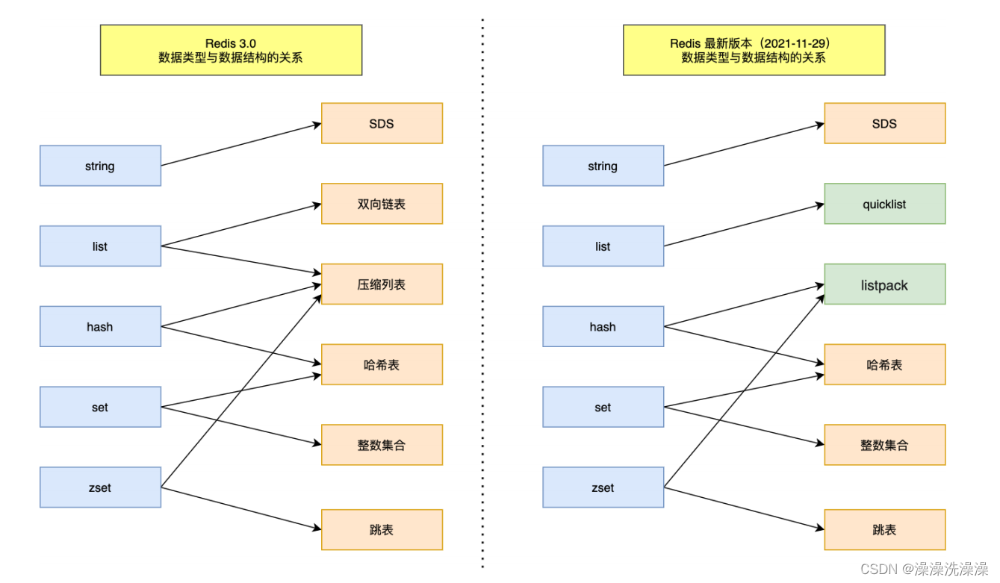
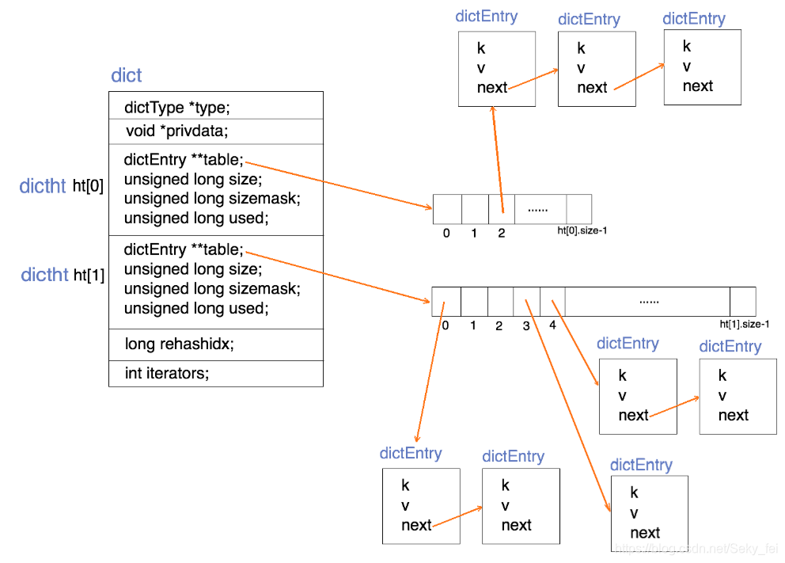
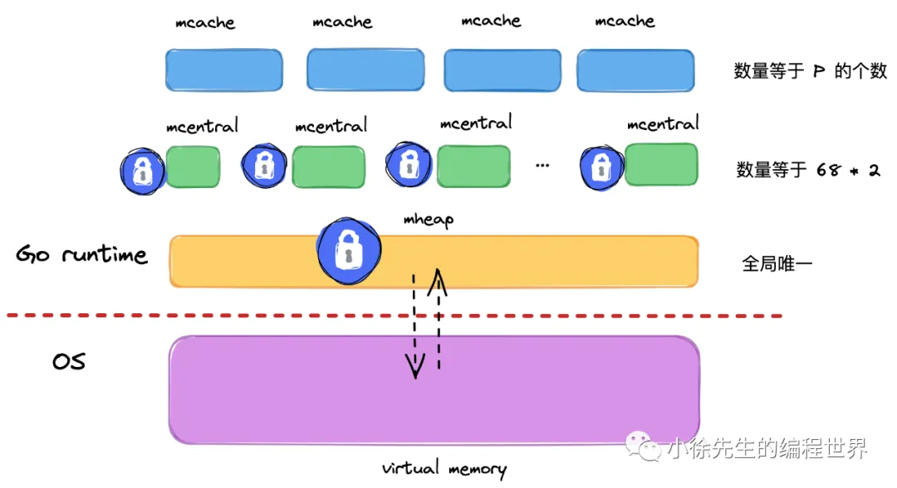
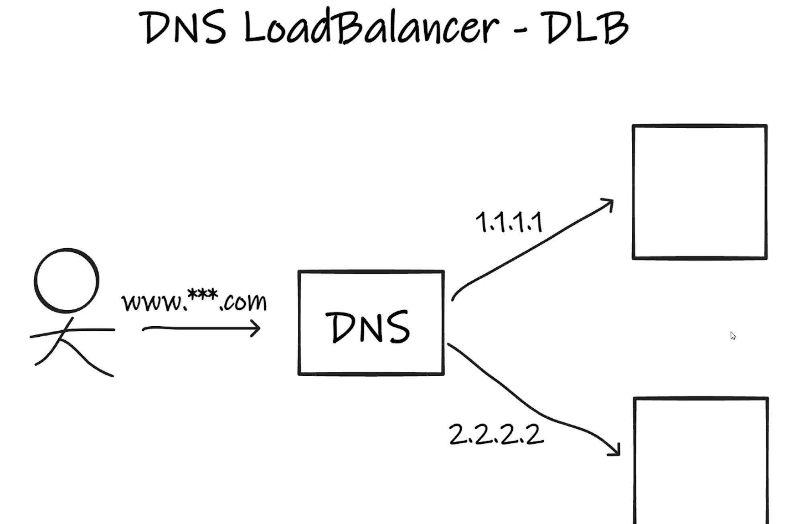
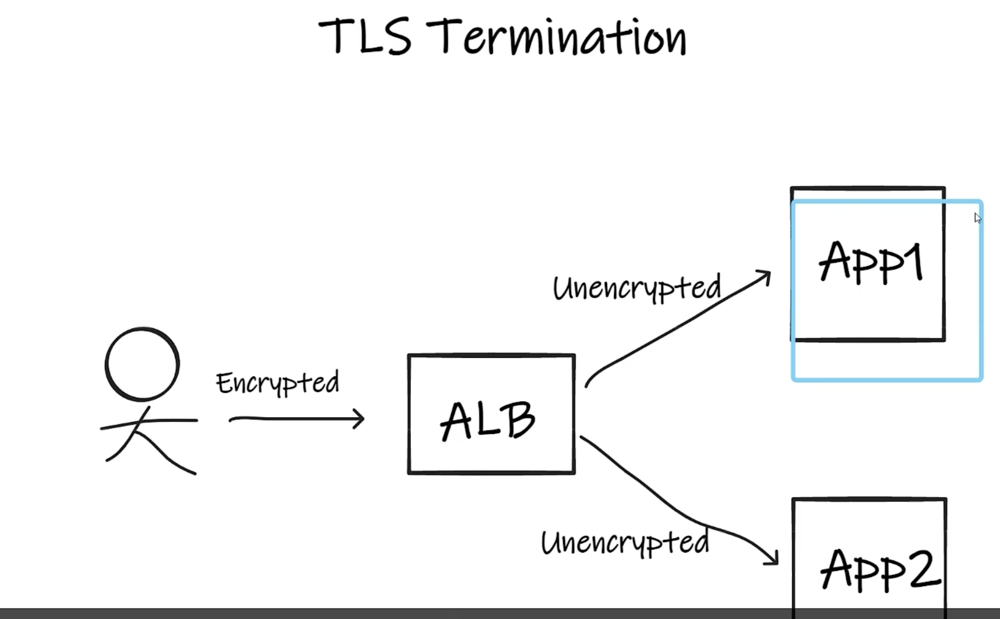
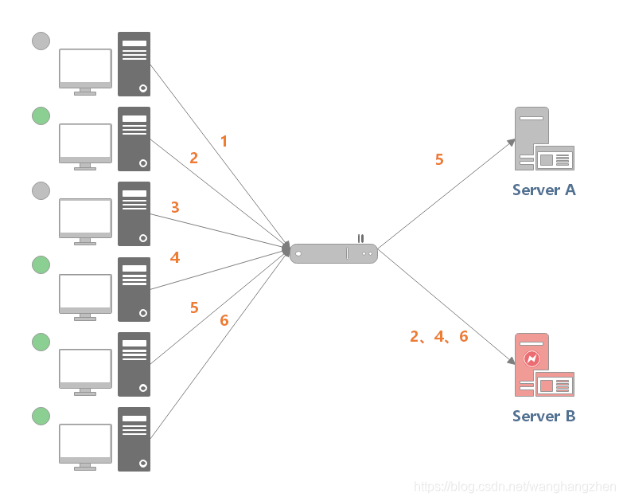
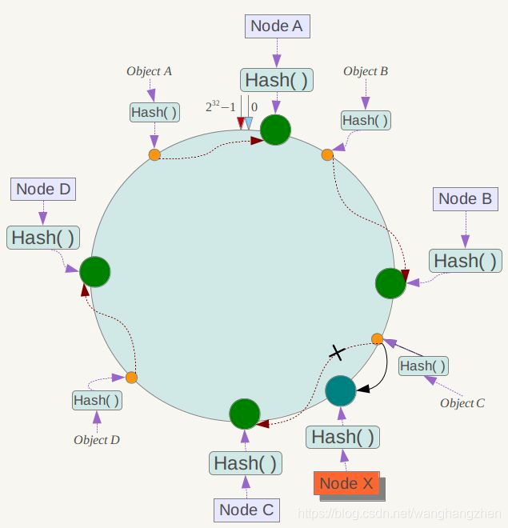

# 计算机网络

## OSI和TCP/IP协议

1. 分别是什么样的结构：

   OSI协议：自顶向下分别为——应用层、表示层、会话层、运输层、网络层、数据链路层、物理层

   TCP/IP协议：自顶向下分别为——应用层、传输层、网际网层、网络接口层、物理层
   


## 从输入URL到显示页面的全过程

1. URL解析：浏览器根据用户输入的URL，解析出协议（例如HTTP或HTTPS）、域名、端口号（如果有）、路径以及查询参数等信息。

2. DNS解析：浏览器向本地DNS服务器发送一个DNS查询请求，查询目标域名对应的IP地址。如果本地DNS服务器中不存在对应的IP地址，则会向上级DNS服务器发送查询请求，直到找到目标域名的IP地址为止。

3. 建立TCP连接：浏览器通过解析得到的IP地址和端口号，与服务器建立TCP连接。这个过程包括三次握手，即客户端发送SYN包，服务器返回SYN+ACK包，最后客户端发送ACK包。
4. 发起HTTP请求：建立TCP连接后，浏览器会向服务器发送一个HTTP请求，请求服务器提供对应URL的资源（通常是HTML页面）。
5. 服务器处理请求：服务器接收到浏览器发送的HTTP请求后，会根据请求的内容进行处理，然后将处理结果（通常是HTML文档）作为HTTP响应返回给浏览器。
6. 接收响应并渲染页面：浏览器接收到服务器的响应后，会解析HTML文档，然后根据HTML中的内容、样式表、JavaScript脚本等资源，渲染出页面的结构、样式和交互效果。
7. 关闭TCP连接：页面渲染完毕后，浏览器会关闭与服务器之间的TCP连接。
8. 显示页面：最后，浏览器会将渲染好的页面显示给用户。


## HTTP和HTTPS

### HTTP和HTTPS是什么：

* HTTP为超文本传输协议，是一种工作于应用层上的协议，是一个在计算机世界里专门在「两点」之间「传输」文字、图片、音频、视频等「超文本」数据的「约定和规范」；默认端口为80

* 由于HTTP是明码传输，存在着被窃听、篡改、冒充的风险，因此HTTPS在HTTP的基础上，于HTTP层和TCP层之间加入了一个SSL/TLS协议层，通过混合加密、摘要算法、数字证书的方法解决了HTTP的短板；默认端口为443


### HTTPS的通信过程：

如HTTP一样，HTTPS需要首先经过3次tcp层的握手，但在此之后，还要进行SSL/TLS握手，然后才能进行加密报文传输

上个问题也提到过HTTPS使用了混合加密，指的是在通信建立之前，使用的是非对称加密方式交换会话密钥（确保安全），而在建立通信之后，使用对称加密方式加密明文数据（保证效率）

> SSL/TLS协议握手：
>
> 其过程设计4次通信，使用不同的密钥交换算法，TLS 握手流程也会不一样；一般来说过程如下⬇️
>
> *1. ClientHello*
>
> 首先，由客户端向服务器发起加密通信请求，也就是 `ClientHello` 请求。
>
> 在这一步，客户端主要向服务器发送以下信息：
>
> （1）客户端支持的 TLS 协议版本，如 TLS 1.2 版本。
>
> （2）客户端生产的随机数（`Client Random`），后面用于生成「会话秘钥」条件之一。
>
> （3）客户端支持的密码套件列表，如 RSA 加密算法。
>
> *2. SeverHello*
>
> 服务器收到客户端请求后，向客户端发出响应，也就是 `SeverHello`。服务器回应的内容有如下内容：
>
> （1）确认 TLS 协议版本，如果浏览器不支持，则关闭加密通信。
>
> （2）服务器生产的随机数（`Server Random`），也是后面用于生产「会话秘钥」条件之一。
>
> （3）确认的密码套件列表，如 RSA 加密算法。
>
> （4）服务器的数字证书。
>
> *3.客户端回应*
>
> 客户端收到服务器的回应之后，首先通过浏览器或者操作系统中的 CA 公钥，确认服务器的数字证书的真实性。
>
> 如果证书没有问题，客户端会**从数字证书中取出服务器的公钥**，然后使用它加密报文，向服务器发送如下信息：
>
> （1）一个随机数（`pre-master key`）。该随机数会被服务器公钥加密。
>
> （2）加密通信算法改变通知，表示随后的信息都将用「会话秘钥」加密通信。
>
> （3）客户端握手结束通知，表示客户端的握手阶段已经结束。这一项同时把之前所有内容的发生的数据做个摘要，用来供服务端校验。
>
> 上面第一项的随机数是整个握手阶段的第三个随机数，会发给服务端，所以这个随机数客户端和服务端都是一样的。
>
> **服务器和客户端有了这三个随机数（Client Random、Server Random、pre-master key），接着就用双方协商的加密算法，各自生成本次通信的「会话秘钥」**。
>
> *4. 服务器的最后回应*
>
> 服务器收到客户端的第三个随机数（`pre-master key`）之后，通过协商的加密算法，计算出本次通信的「会话秘钥」。
>
> 然后，向客户端发送最后的信息：
>
> （1）加密通信算法改变通知，表示随后的信息都将用「会话秘钥」加密通信。
>
> （2）服务器握手结束通知，表示服务器的握手阶段已经结束。这一项同时把之前所有内容的发生的数据做个摘要，用来供客户端校验。
>
> 至此，整个 TLS 的握手阶段全部结束。接下来，客户端与服务器进入加密通信，就完全是使用普通的 HTTP 协议，只不过用「会话秘钥」加密内容

由于得到了CA的背书，HTTPS一定是安全的。如果说有什么风险，那就是有中间服务器同时冒充服务端和客户端夹在双方的通信之间进行消息的转发，但只要用户不在收到HTTPS警告的时候选择无视警告继续连接，那么HTTPS还是客观上安全的

1. 常见的状态码：

   * `1xx` 类状态码属于**提示信息**，是协议处理中的一种中间状态，实际用到的比较少

   * `2xx` 类状态码表示服务器**成功**处理了客户端的请求，也是我们最愿意看到的状态

     - 「**200 OK**」是最常见的成功状态码，表示一切正常。如果是非 `HEAD` 请求，服务器返回的响应头都会有 body 数据
     - 「**204 No Content**」也是常见的成功状态码，与 200 OK 基本相同，但响应头没有 body 数据
     - 「**206 Partial Content**」是应用于 HTTP 分块下载或断点续传，表示响应返回的 body 数据并不是资源的全部，而是其中的一部分，也是服务器处理成功的状态

   * `3xx` 类状态码表示客户端请求的资源发生了变动，需要客户端用新的 URL 重新发送请求获取资源，也就是**重定向**

     - 「**301 Moved Permanently**」表示永久重定向，说明请求的资源已经不存在了，需改用新的 URL 再次访问
     - 「**302 Found**」表示临时重定向，说明请求的资源还在，但暂时需要用另一个 URL 来访问

     301 和 302 都会在响应头里使用字段 `Location`，指明后续要跳转的 URL，浏览器会自动重定向新的 URL

     - 「**304 Not Modified**」不具有跳转的含义，表示资源未修改，重定向已存在的缓冲文件，也称缓存重定向，也就是告诉客户端可以继续使用缓存资源，用于缓存控制

   * `4xx` 类状态码表示客户端发送的**报文有误**，服务器无法处理，也就是错误码的含义

     - 「**400 Bad Request**」表示客户端请求的报文有错误，但只是个笼统的错误
     - 「**403 Forbidden**」表示服务器禁止访问资源，并不是客户端的请求出错
     - 「**404 Not Found**」表示请求的资源在服务器上不存在或未找到，所以无法提供给客户端

   * `5xx` 类状态码表示客户端请求报文正确，但是**服务器处理时内部发生了错误**，属于服务器端的错误码

     - 「**500 Internal Server Error**」与 400 类型，是个笼统通用的错误码，服务器发生了什么错误，我们并不知道
     - 「**501 Not Implemented**」表示客户端请求的功能还不支持，类似“即将开业，敬请期待”的意思
     - 「**502 Bad Gateway**」通常是服务器作为网关或代理时返回的错误码，表示服务器自身工作正常，访问后端服务器发生了错误
     - 「**503 Service Unavailable**」表示服务器当前很忙，暂时无法响应客户端，类似“网络服务正忙，请稍后重试”的意思


### GET与POST：

根据 RFC 规范，GET 的语义是从服务器获取指定的资源，POST 的语义是根据请求负荷（报文body）对指定的资源做出处理。简单来说，前者一般用来获取资源，后者用来提交请求

> 关于二者是否安全（不会破坏服务器上的资源）、幂等（多次执行相同的操作，结果是一样的）
>
> - **GET 方法就是安全且幂等的**，因为它是「只读」操作，无论操作多少次，服务器上的数据都是安全的，且每次的结果都是相同的。所以，**可以对 GET 请求的数据做缓存，这个缓存可以做到浏览器本身上（彻底避免浏览器发请求），也可以做到代理上（如nginx），而且在浏览器中 GET 请求可以保存为书签**。
> - **POST** 因为是「新增或提交数据」的操作，会修改服务器上的资源，所以是**不安全**的，且多次提交数据就会创建多个资源，所以**不是幂等**的。所以，**浏览器一般不会缓存 POST 请求，也不能把 POST 请求保存为书签**
>
> 然而现实使用的时候未必会遵守规范，所以GET可能也是不安全且不幂等，POST也可以是安全且幂等的


### HTTP/1.1、HTTP/2、HTTP/3:

* HTTP/1.1：

  优点

  - 使用长连接的方式改善了 HTTP/1.0 短连接造成的性能开销（短连接：每次发送请求都要进行3次握手、4次挥手）
  - 支持管道（pipeline）网络传输，只要第一个请求发出去了，不必等其回来，就可以发第二个请求出去，可以减少整体的响应时间

  缺点：

  * 请求 / 响应头部（Header）未经压缩就发送，首部信息越多延迟越大。只能压缩 `Body` 的部分
  * 发送冗长的首部。每次互相发送相同的首部造成的浪费较多
  * 服务器是按请求的顺序响应的，如果服务器响应慢，会招致客户端一直请求不到数据，也就是队头阻塞
  * 没有请求优先级控制
  * 请求只能从客户端开始，服务器只能被动响应

* HTTP/2（从HTTP/2开始都是基于HTTPS的了，所以安全性得到保证）：

  优点：

  * 头部压缩：如果你同时发出多个请求，他们的头是一样的或是相似的，那么，协议会帮你消除重复的部分
  * 二进制格式：HTTP/2 不再像 HTTP/1.1 里的纯文本形式的报文，而是全面采用了二进制格式，头信息和数据体都是二进制，并且统称为帧（frame）：头信息帧（Headers Frame）和数据帧（Data Frame）
  * 并发传输：提出了Stream概念，让多个Stream复用在同一条TCP连接上，解决了HTTP/1.1在应用层的队头阻塞问题
  * 服务器主动推送资源：服务端不再是被动地响应，可以主动向客户端发送消息

  缺点：

  * HTTP/2 通过 Stream 的并发能力，解决了 HTTP/1 队头阻塞的问题，但在TCP这一层依然存在队头阻塞问题：由于TCP是基于字节流的协议，只要前一个字节的数据没有送到，就会出发TCP的重传机制，那么还是会发生阻塞

* HTTP/3:

  优点：

  * 主要解决了HTTP/2的对头阻塞问题，方法就是：把TCP换成UDP（）虽然UDP本身不支持重传和发送顺序的，但基于 UDP的QUIC协议可以实现类似 TCP 的可靠性传输


## HTTP和RPC

1. RPC是什么：

   RPC全名远程过程调用，其本身虽然运作在应用层，但并不是一种协议，而是一种调用方式——通过屏蔽掉一些网络细节，使程序员能够像调用本地方法一样调用一个远程服务器的方法

2. 既然有了HTTP，为什么还需要RPC：

   然而事实是：RPC的出现比HTTP更早

   > 现在电脑上装的各种**联网**软件，比如 xx管家，xx卫士，它们都作为**客户端（Client）需要跟服务端（Server）建立连接收发消息**，此时都会用到应用层协议，在这种 Client/Server (C/S) 架构下，它们可以使用自家造的 RPC 协议，因为它只管连自己公司的服务器就 ok 了。
   >
   > 但有个软件不同，**浏览器（Browser）**，不管是 Chrome 还是 IE，它们不仅要能访问自家公司的**服务器（Server）**，还需要访问其他公司的网站服务器，因此它们需要有个统一的标准，不然大家没法交流。于是，HTTP 就是那个时代用于统一 **Browser/Server (B/S)** 的协议。
   >
   > 也就是说在多年以前，**HTTP 主要用于 B/S 架构，而 RPC 更多用于 C/S 架构。但现在其实已经没分那么清了，B/S 和 C/S 在慢慢融合。\**很多软件同时支持多端，比如某度云盘，既要支持\**网页版**，还要支持**手机端和 PC 端**，如果通信协议都用 HTTP 的话，那服务器只用同一套就够了。而 RPC 就开始退居幕后，一般用于公司内部集群里，各个微服务之间的通讯

   这里需要说一说两者之间的区别：
   
   * 服务发现：两者其实大差不差，HTTP需要DNS来将域名转换为IP地址，而RPC需要诸如Etcd、Redis、Consul之类中间件来保存并获取IP和端口信息
   * 底层连接形式：以主流的HTTP/1.1协议为例，其默认在建立底层 TCP 连接之后会一直保持这个连接，之后的请求和响应都会复用这条连接；而RPC协议，也跟 HTTP 类似，也是通过建立 TCP 长链接进行数据交互，但不同的地方在于，RPC 协议一般还会再建个**连接池**，在请求量大的时候，建立多条连接放在池内，要发数据的时候就从池里取一条连接出来，**用完放回去，下次再复用**，可以说非常环保。两者也差别不大
   * **传输内容**：这里是两者最大的差异——HTTP传输的内容以字符串为主，由Header和Body构成，其中Body用Json进行序列化，整个结构体中有很多冗余数据，但是为了符合浏览器的协议，不得不保留这部分数据；而RPC定制化程度更高，用作公司内部的微服务的时候可以用体积更小的Protobuf或其他序列化协议去保存结构体数据，同时也不需要像 HTTP 那样考虑各种浏览器行为，比如 302 重定向跳转啥的，**因此性能也会更好一些**


## TCP

### TCP报文格式：

比较重要的有以下几个：

* 序列号：在建立连接时由计算机生成的随机数作为其初始值，通过 SYN 包传给接收端主机，每发送一次数据，就「累加」一次该「数据字节数」的大小。**用来解决网络包乱序问题**
* 确认应答号：指下一次「期望」收到的数据的序列号，发送端收到这个确认应答以后可以认为在这个序号以前的数据都已经被正常接收。**用来解决丢包的问题**
* 控制位：
  * *ACK*：该位为 `1` 时，「确认应答」的字段变为有效，TCP 规定除了最初建立连接时的 `SYN` 包之外该位必须设置为 `1` 
  * *RST*：该位为 `1` 时，表示 TCP 连接中出现异常必须强制断开连接
  * *SYN*：该位为 `1` 时，表示希望建立连接，并在其「序列号」的字段进行序列号初始值的设定
  * *FIN*：该位为 `1` 时，表示今后不会再有数据发送，希望断开连接。当通信结束希望断开连接时，通信双方的主机之间就可以相互交换 `FIN` 位为 1 的 TCP 段


### 为什么需要TCP：

因为IP层的传输是**不可靠的**，只负责传，不保证包的交付，不保证交付的顺序，不保证包的完整性。所以我们需要在传输层保证数据的可靠性。

这就决定了TCP是**面向连接的、可靠的、面向字节流**的传输协议


### TCP和UDP区别

1. TCP是面向连接的，UDP是无连接的
2. TCP是可靠的，UDP是不可靠的
3. TCP是面向字节流的，UDP是面向数据报文的
4. TCP只支持点对点通信，UDP支持一对一，一对多，多对多
5. TCP报文首部20个字节，UDP首部8个字节
6. TCP有拥塞控制机制，UDP没有
7. TCP协议下双方发送接受缓冲区都有，UDP并无实际意义上的发送缓冲区，但是存在接受缓冲区


### TCP和UDP可以使用同一个端口吗？为什么：

**可以的**

正如在数据链路层中，通过 MAC 地址来寻找局域网中的主机。在网际层中，通过 IP 地址来寻找网络中互连的主机或路由器。在传输层中，需要通过端口进行寻址，来识别同一计算机中同时通信的不同应用程序

所以，端口的作用是为了区分同一个主机上不同应用程序的数据包，而TCP和UDP在内核中是两个完全独立的软件模块。当主机收到数据包后，可以在 IP 包头的「协议号」字段知道该数据包是 TCP/UDP，所以可以根据这个信息确定送给哪个模块（TCP/UDP）处理，送给 TCP/UDP 模块的报文根据「端口号」确定送给哪个应用程序处理

因此，TCP/UDP 各自的端口号也相互独立，如 TCP 有一个 80 号端口，UDP 也可以有一个 80 号端口，二者并不冲突


### 3次握手以及能否增减次数：

过程如下：

* 一开始，客户端和服务端都处于 `CLOSE` 状态。先是服务端主动监听某个端口，处于 `LISTEN` 状态
* 客户端会随机初始化序号（`client_isn`），将此序号置于 TCP 首部的「序号」字段中，同时把 `SYN` 标志位置为 `1`，表示 `SYN` 报文。接着把第一个 SYN 报文发送给服务端，表示向服务端发起连接，该报文不包含应用层数据，之后客户端处于 `SYN-SENT` 状态
* 服务端收到客户端的 `SYN` 报文后，首先服务端也随机初始化自己的序号（`server_isn`），将此序号填入 TCP 首部的「序号」字段中，其次把 TCP 首部的「确认应答号」字段填入 `client_isn + 1`, 接着把 `SYN` 和 `ACK` 标志位置为 `1`。最后把该报文发给客户端，该报文也不包含应用层数据，之后服务端处于 `SYN-RCVD` 状态
* 客户端收到服务端报文后，还要向服务端回应最后一个应答报文，首先该应答报文 TCP 首部 `ACK` 标志位置为 `1` ，其次「确认应答号」字段填入 `server_isn + 1` ，最后把报文发送给服务端，这次报文可以携带客户到服务端的数据，之后客户端处于 `ESTABLISHED` 状态
* 服务端收到客户端的应答报文后，也进入 `ESTABLISHED` 状态

可以看出，**第三次握手时可以携带数据的，但前两次不行**

> ## 为什么是3次握手而不是2次或者4次
>
> 三次握手的原因如下：
>
> - 三次握手才可以阻止重复历史连接的初始化（主要原因）
> - 三次握手才可以同步双方的初始序列号
> - 三次握手才可以避免资源浪费
>
> 
>
> ### 如果是2次握手
>
> 在两次握手的情况下，服务端在收到 SYN 报文后，就进入 ESTABLISHED 状态，意味着这时可以给对方发送数据，但是客户端此时还没有进入 ESTABLISHED 状态，假设这次是历史连接，客户端判断到此次连接为历史连接，那么就会回 RST 报文来断开连接，而服务端在第一次握手的时候就进入 ESTABLISHED 状态，所以它可以发送数据的，但是它并不知道这个是历史连接，它只有在收到 RST 报文后，才会断开连接
>
> ### 如果是4次握手
>
> 三次握手就已经理论上最少可靠连接建立，所以不需要使用更多的通信次数


### 4次挥手以及能否减少次数：

过程如下：

* 客户端打算关闭连接，此时会发送一个 TCP 首部 `FIN` 标志位被置为 `1` 的报文，也即 `FIN` 报文，之后客户端进入 `FIN_WAIT_1` 状态
* 服务端收到该报文后，就向客户端发送 `ACK` 应答报文，接着服务端进入 `CLOSE_WAIT` 状态
* 客户端收到服务端的 `ACK` 应答报文后，之后进入 `FIN_WAIT_2` 状态
* 等待服务端处理完数据后，也向客户端发送 `FIN` 报文，之后服务端进入 `LAST_ACK` 状态
* 客户端收到服务端的 `FIN` 报文后，回一个 `ACK` 应答报文，之后进入 `TIME_WAIT` 状态
* 服务端收到了 `ACK` 应答报文后，就进入了 `CLOSE` 状态，至此服务端已经完成连接的关闭
* 客户端在经过 `2MSL` 一段时间后，自动进入 `CLOSE` 状态，至此客户端也完成连接的关闭

客户端和服务端各有一个FIN和ACK，所以是4次挥手，此外**主动关闭连接的才会有TIME_WAIT状态**

> ## 能否变成3次挥手
>
> 直接说结论，可以的，如果被动关闭方「**没有数据要发送」并且「开启了 TCP 延迟确认机制」**，那么第二次和第三次握手就会被合并到一起。事实上现代互联网三次握手是一种比较常见的情况，因为TCP延迟确认机制是默认开启的
>
> 
>
> ### 什么是延迟确认机制
>
> 由于不携带数据的ACK是效率非常低的（因为尽管没有数据，ACK依然占用了20个字节的IP头和20个字节的TCP头），所以我们希望尽可能让ACK携带数据进行传输，这就是延迟确认机制，具体策略如下：
>
> - 当有响应数据要发送时，ACK 会随着响应数据一起立刻发送给对方
> - 当没有响应数据要发送时，ACK 将会延迟一段时间，以等待是否有响应数据可以一起发送
> - 如果在延迟等待发送 ACK 期间，对方的第二个数据报文又到达了，这时就会立刻发送 ACK


### 为什么需要TIME_WAIT状态：

* 为了防止历史连接中的消息被后续相同的四元组接收
* 保证「被动关闭连接」的一方，能被正确的关闭
* 因为客户端发送的第四次挥手的ACK应答数据包，服务端可能没有收到，如果服务端在发送第三次挥手的FIN数据包后，等待一段时间后没有收到ACK应答，那么会重新发送第三次挥手的FIN数据包，客户端收到后再次发送第四次挥手的ACK数据包


### 为什么是2MSL时长

2MSL，即两个最大报文段生存时间。

确保被动关闭TCP连接的一端能收到第四次挥手的ACK 避免上一次TCP连接的数据包影响到下一次的TCP连接


### TCP滑动窗口：

类似于CPU的流水线，客户端在发送这个窗口范围之内的数据包的时候，不需要等待服务端的确认即可发送下一个数据包。在这个过程中，即使数据包的应答报文丢失了，也不会触发重传机制，可以通过「下一个确认应答进行确认」

滑动窗口的大小一般由接收方来决定，发送方发送的数据大小不能超过接收方的窗口大小，否则接收方就无法正常接收到数据


### TCP流量控制：

如果发送方把数据发送的过快，接收方就可能来不及接收，这就会造成数据的丢失，`流量控制`就是让发送方的发送速率不要太快，让接收方来得及接收所有数据，具体的实现方法就是通过动态调整滑动窗口大小——如果应用程序没有办法一次性消费所有数据包，那么尚未消费的部分会留在接收方的缓冲区中，这个时候接收方需要发送改变滑动窗口大小的通知给发送方

但是如果这个时候，由于操作系统实在过于繁忙，不得不缩小缓冲区使得缓冲区大小小于未消费数据包的大小，那么势必就会造成数据包的丢失，而另一方面，收到了收缩窗口大小请求的发送方可能会出现滑动窗口大小被调整成负值的情况。**为了防止这种情况发生，TCP 规定是不允许同时减少缓存又收缩窗口的，而是采用先收缩窗口，过段时间再减少缓存，这样就可以避免了丢包情况**


### TCP拥塞控制：

当网络出现拥堵时，数据包丢失、时延的可能性会变大，这个时候如果触发了发送方的超时重传机制，那么对整个网络的负担会更大，因此我们需要拥塞控制，当网络发送拥塞时，TCP会主动降低发送的数据量。这就引出了**拥塞窗口**，这是由发送方维护的一个状态变量，会根据网络的拥塞程度动态变化，大小为```min(发送窗口, 接受窗口)```

> ## 如何知道当前网络是否出现了拥塞
>
> 只要发送方没有在规定时间内收到ACK报文，触发了超时重传，则认为出现了拥塞
>
> 
>
> ## 拥塞控制的4种算法
>
> 1. 慢启动：
>
>    **当发送方每收到一个 ACK，拥塞窗口 cwnd 的大小就会加 1**，直观点的说法就是每一个轮次的拥塞窗口大小呈指数级增长：1、2、4、8、16......
>
>    虽然增长速度很快，但是启动时的窗口大小很小，所以叫慢启动
>
>    慢启动有一个ssthresh变量（**一般来说ssthresh的大小为2^16 - 1个字节**）：
>
>    * 当拥塞窗口大小cwnd < ssthresh，使用慢启动
>    * 当拥塞窗口大小cwnd >= ssthresh， 使用拥塞避免算法
>
> 2. 拥塞避免算法：
>
>    进入拥塞避免算法后，cwnd的规则是：**每当收到一个 ACK 时，cwnd 增加 1/cwnd**
>
> 3. 拥塞发生：
>
>    当网络出现拥塞，也就是会发生数据包重传，重传机制主要有两种：
>
>    - 超时重传
>    - 快速重传
>
>    ### 超时重传
>
>    当发生了「超时重传」，ssthresh 和 cwnd 的值会发生变化：
>
>    - `ssthresh` 设为 `cwnd/2`，
>    - `cwnd` 重置为 `1` （是恢复为 cwnd 初始化值，我这里假定 cwnd 初始化值 1）
>
>    接着，就重新开始慢启动，慢启动是会突然减少数据流的。这真是一旦「超时重传」，马上回到解放前。但是这种方式太激进了，反应也很强烈，会造成网络卡顿
>
>    ### 快速重传
>
>    如果接收方连续收到了3个重复的ACK，说明网络并不是那么糟糕，但是还是要处理，所以没有必要像RT0超时那样强烈，此时就会进入快速重传算法：
>
>    - 拥塞窗口 `cwnd = ssthresh + 3` （ 3 的意思是确认有 3 个数据包被收到了）
>    - 重传丢失的数据包
>    - 如果再收到重复的 ACK，那么 cwnd 增加 1
>    - 如果收到新数据的 ACK 后，把 cwnd 设置为第一步中的 ssthresh 的值，原因是该 ACK 确认了新的数据，说明从 duplicated ACK 时的数据都已收到，该恢复过程已经结束，可以回到恢复之前的状态了，也即再次进入拥塞避免状态


## IP

### 基本认知：

IP工作在TCP/IP网络的第三层——网络层，该层的主要作用是负责主机与主机之间的点对点通信

> ## 区分IP和MAC
>
> 很简单
>
> * **MAC 的作用是实现「直连」的两个设备之间通信，而 IP 则负责在「没有直连」的两个网络之间进行通信传输**
>
> IP层隐藏了数据链路层的很多细节，从外界来看实现了不同网络之间的两台主机的点对点连接，但在底层的设计上，其实是从主机到路由再到主机的一步步转发，而这个转发是由MAC实现的


### IP分类：

IPv4的地址被分为A,B,C,D,E一共五类，区分方式为关注IP地址的前1/2/3/4/5位是否为零，其中，ABC三类用于普通的网络服务，D类常用于多播，而E类还没有用到，具体的网络号、主机号划分可以直接百度（）


### 单播、广播和多播：


### 无地址分类CIDR：

简单来说就是IP地址+子网掩码，细节不多说了反正会了


## Ping和ICMP：

### ICMP协议

ICMP协议（互联网控制报文协议），主要功能包括：**确认 IP 包是否成功送达目标地址、报告发送过程中 IP 包被废弃的原因和改善网络设置等**，与IP同样工作在网络层

ICMP报文可以分为两大类：

- 一类是用于诊断的查询消息，也就是「**查询报文类型**」
- 另一类是通知出错原因的错误消息，也就是「**差错报文类型**」


### Ping——查询报文类型的使用

ping是一个应用层指令，它的功能比较简单，就是**尝试**发送一个小小的消息到目标机器上，判断目的机器是否**可达**，其实也就是判断目标机器网络是否能连通

在执行ping指令之后，ICMP报文+IP头+MAC头层层包装后发送到目标主机，目标主机在接收到数据包之后会返回一个响应报文，结构与查询报文相同


### 127.0.0.1 和 localhost 以及 0.0.0.0 有区别吗

* 首先localhost不是IP，本质上是和"baidu.com"一样是一个域名，但是会被默认解析为127.0.0.1，所以localhost和127.0.0.1实际上是等价的

* 其次，ping 0.0.0.0会失败，因为它在`IPV4`中表示的是无效的**目标地址**，但是，如果我们监听0.0.0.0的时候，它表示本机上的**所有IPV4地址**，这个时候不管使用的是**本机地址（en0）**还是**回环地址（lo）**都会访问到这个服务器


# Redis

## 什么是Redis：

Redis 是一种基于内存的数据库，对数据的读写操作都是在内存中完成，因此**读写速度非常快**，常用于**缓存，消息队列、分布式锁等场景**

Redis 提供了多种数据类型来支持不同的业务场景，比如 String(字符串)、Hash(哈希)、 List (列表)、Set(集合)、Zset(有序集合)、Bitmaps（位图）、HyperLogLog（基数统计）、GEO（地理信息）、Stream（流），并且对数据类型的操作都是**原子性**的，因为执行命令由单线程负责的，不存在并发竞争的问题

一般使用Redis作为MySql的缓存，因为Redis的速度很快很快，而且是高性能和高并发的


## Redis的数据结构和使用场景：

- String 类型的应用场景：缓存对象、常规计数、分布式锁、共享 session 信息等
- List 类型的应用场景：消息队列（但是有两个问题：1. 生产者需要自行实现全局唯一 ID；2. 不能以消费组形式消费数据）等
- Hash 类型：缓存对象、购物车等
- Set 类型：聚合计算（并集、交集、差集）场景，比如点赞、共同关注、抽奖活动等
- Zset 类型：排序场景，比如排行榜、电话和姓名排序等
- BitMap（2.2 版新增）：二值状态统计的场景，比如签到、判断用户登陆状态、连续签到用户总数等；
- HyperLogLog（2.8 版新增）：海量数据基数统计的场景，比如百万级网页 UV 计数等；
- GEO（3.2 版新增）：存储地理位置信息的场景，比如滴滴叫车；
- Stream（5.0 版新增）：消息队列，相比于基于 List 类型实现的消息队列，有这两个特有的特性：自动生成全局唯一消息ID，支持以消费组形式消费数据




## Redis数据结构

### 底层数据类型

#### 字典（Dict）

dict是一个用于维护key和value映射关系的数据结构。Redis的一个database中所有key到value的映射，就是使用一个dict来维护的。dict本质上是为了解决算法中的查找问题

```c++
// dict的数据结构定义
struct dict {
    dictType *type;

    dictEntry **ht_table[2];
    unsigned long ht_used[2];

    long rehashidx; /* rehashing not in progress if rehashidx == -1 */

    /* Keep small vars at end for optimal (minimal) struct padding */
    unsigned pauserehash : 15; /* If >0 rehashing is paused */

    unsigned useStoredKeyApi : 1; /* See comment of storedHashFunction above */
    signed char ht_size_exp[2]; /* exponent of size. (size = 1<<exp) */
    int16_t pauseAutoResize;  /* If >0 automatic resizing is disallowed (<0 indicates coding error) */
    void *metadata[];
};
```



- dict采用哈希函数对key取哈希值，得到在哈希表中的位置(桶的位置)，再采用拉链法解决hash冲突。

- 两个哈希表（ht[2]）：只有在重哈希的过程中，ht[0]和ht[1]才都有效。而在平常情况下，只有ht[0]有效，ht[1]里面没有任何数据。上图表示的就是重哈希进行到中间某一步时的情况。

- 重哈希过程：跟HashMap一样，当装载因子（load factor）超过预定值时就会进行rehash。dict进行重hash扩容是将ht[0]上某一个bucket（即一个dictEntry链表）上的每一个dictEntry移动到扩容后的ht[1]上，能触发rehash的操作有查询、插入和删除元素。每次移动一个链表（即渐进式rehash）原因是为了防止redis长时间的堵塞导致不可用。

- dict添加操作：如果正在重哈希中，会把数据插入到ht[1]；否则插入到ht[0]。

- dict查询操作：先在第一个哈希表ht[0]上进行查找，再判断当前是否在重哈希，如果没有，那么在ht[0]上的查找结果就是最终结果。否则，再在ht[1]上进行查找。查询时会先根据key计算出桶的位置，在到桶里的链表上寻找key。

- dict删除操作：判断当前是不是在重哈希过程中，如果是只在ht[0]中查找要删除的key；否则ht[0]和ht[1]它都要查找删除。

##### rehash的触发条件：

1. 计算负载因子：

   ```c++
   #哈希表的负载因子计算：负载因子 = 哈希表已保存节点数量 / 哈希表大小
   load_factor = ht[0].used / ht[0].size
   ```

2. 触发rehash：

   一种是触发扩容操作，另一种是触发收缩操作。两种rehash触发的条件是不一样的，需要各自满足一下条件才能导致rehash操作。

   - 扩容：

     - 服务器目前没有在执行 BGSAVE 命令或者 BGREWRITEAOF 命令，并且哈希表的负载因子大于等于 1
     - 服务器目前正在执行 BGSAVE 命令或者 BGREWRITEAOF 命令，并且哈希表的负载因子大于等于 5

     > 根据 BGSAVE 命令或 BGREWRITEAOF 命令是否正在执行，服务器执行扩展操作所需的负载因子并不相同，这是因为在执行 BGSAVE 命令或 BGREWRITEAOF命令的过程中， Redis会fork一个子进程，而大多数操作系统都采用写时复制（copy-on-write）技术来优化子进程的使用效率，所以在子进程存在期间， 服务器会提高执行扩展操作所需的负载因子，从而尽可能地避免在子进程存在期间进行哈希表扩展操作，这可以避免不必要的内存写入操作， 最大限度地节约内存

   - 收缩：

     - 当哈希表的负载因子小于0.1时，程序自动开始对哈希表执行收缩操作

   Rehash的整个过程是分多批次的、渐进的，这是为了避免在迁移过大的数据量的时候导致线程的阻塞


#### 简单动态字符串（SDS）

Redis中为了实现方便的扩展，考虑到安全和性能，自己定义了一个结构用来存储字符串，这个数据结构就是：简单动态字符串(Simple Dynamic String 简称sds)，并将 SDS 用作 Redis 的默认字符串

```c++
/*
 * redis中保存字符串对象的结构
 */
struct sdshdr {
    //用于记录buf数组中使用的字节的数目，和SDS存储的字符串的长度相等 
    int len;
    //用于记录buf数组中没有使用的字节的数目 
    int free;
    //字节数组，用于储存字符串
    char buf[]; //buf的大小等于len+free+1，其中多余的1个字节是用来存储’\0’的
};
```

##### SDS和C字符串的区别

1. 获取字符串长度：

   由于C字符串没有记录自身的长度信息，所以获取C字符串长度的时候，必须遍历整个字符串，其时间复杂度是O(n)，而SDS中有len属性，所以在获取其长度时，时间复杂度为O(1)

2. 内存分配释放策略

   - 对于C字符串而言，不管是字符串拼接，还是字符串缩短，都要扩展底层的char数组的空间大小，再将旧char数据拷贝过来。
   - SDS的内存分配策略就不一样，可以概括为**预分配 + 惰性释放**

   > #### SDS内存分配策略：预分配
   > 1. 如果对SDS字符串修改后，len的值小于1MB，那么程序会分配和len同样大小的空间给free，此时len和free的值是相同。
   >    例如：如果SDS的字符串长度修改为15字节，那么会分配15字节空间给free，SDS的buf属性长度为15（len）+15（free）+1（空字符） = 31字节。
   >
   > 2. 如果SDS字符串修改后，len大于等于1MB，那么程序会分配1MB的空间给free。
   >    例如：SDS字符串长度修改为50MB那么程序会分配1MB的未使用空间给free，SDS的buf属性长度为 50MB（len）+1MB（free）+1byte（空字符）。
   >
   > #### SDS内存释放策略：惰性释放
   > 1. 当需要缩短SDS字符串时，程序并不立刻将内存释放，而是使用free属性将这些空间记录下来，实际的buf大小不会变，以备将来使用。

   这样做带来的优点就是能够有效缓解字符串扩容时可能导致的缓冲区溢出问题，并且由于使用二进制存储数据，对于存放数据的格式没有要求（不像C字符串那样要求以"\0"结尾）


#### 整数集合（intset）

intset是Redis集合的底层实现之一，当存储整数集合并且数据量较小的情况下Redis会使用intset作为set的底层实现，当数据量较大或者集合元素为字符串时则会使用dict实现set

```c++
typedef struct intset {
    uint32_t encoding;
    uint32_t length;
    int8_t contents[];
} intset;
```


#### 跳表（Skip List）

**跳表是在链表基础上改进过来的，实现了一种「多层」的有序链表**

「跳表节点」以及「跳表」的数据结构代码如下：

```c++
typedef struct zskiplistNode {
    //Zset 对象的元素值
    sds ele;
    //元素权重值
    double score;
    //后向指针
    struct zskiplistNode *backward;
  
    //节点的level数组，保存每层上的前向指针和跨度
    struct zskiplistLevel {
        struct zskiplistNode *forward;
        unsigned long span;
    } level[];
} zskiplistNode;

typedef struct zskiplist {
    struct zskiplistNode *header, *tail;
    unsigned long length;
    int level;
} zskiplist;
```

整体上的查询类似于二分查找的效果：

- 如果当前节点的权重「小于」要查找的权重时，跳表就会访问该层上的下一个节点。
- 如果当前节点的权重「等于」要查找的权重时，并且当前节点的 SDS 类型数据「小于」要查找的数据时，跳表就会访问该层上的下一个节点。

跳表一个比较明显的特征就是，相邻两层之间的节点数量比例近似为1:2


##### 那怎样才能维持相邻两层的节点数量的比例为 2 : 1 呢？

如果采用新增节点或者删除节点时，来调整跳表节点以维持比例的方法的话，会带来额外的开销。

Redis 则采用一种巧妙的方法是，**跳表在创建节点的时候，随机生成每个节点的层数**，并没有严格维持相邻两层的节点数量比例为 2 : 1 的情况。

具体的做法是，**跳表在创建节点时候，会生成范围为[0-1]的一个随机数，如果这个随机数小于 0.25（相当于概率 25%），那么层数就增加 1 层，然后继续生成下一个随机数，直到随机数的结果大于 0.25 结束，最终确定该节点的层数**。

这样的做法，相当于每增加一层的概率不超过 25%，层数越高，概率越低，层高最大限制是 64。


##### 为什么Zset用跳表而不是平衡树

主要是从内存占用、对范围查找的支持、实现难易程度这三方面总结的原因：

- **从内存占用上来比较，跳表比平衡树更灵活一些**。平衡树每个节点包含 2 个指针（分别指向左右子树），而跳表每个节点包含的指针数目平均为 1/(1-p)，具体取决于参数 p 的大小。如果像 Redis里的实现一样，取 p=1/4，那么平均每个节点包含 1.33 个指针，比平衡树更有优势。
- **在做范围查找的时候，跳表比平衡树操作要简单**。在平衡树上，我们找到指定范围的小值之后，还需要以中序遍历的顺序继续寻找其它不超过大值的节点。如果不对平衡树进行一定的改造，这里的中序遍历并不容易实现。而在跳表上进行范围查找就非常简单，只需要在找到小值之后，对第 1 层链表进行若干步的遍历就可以实现。
- **从算法实现难度上来比较，跳表比平衡树要简单得多**。平衡树的插入和删除操作可能引发子树的调整，逻辑复杂，而跳表的插入和删除只需要修改相邻节点的指针，操作简单又快速。


## Redis是单线程吗：

Redis的单线程指的是**「接收客户端请求->解析请求 ->进行数据读写等操作->发送数据给客户端」这个过程是由一个线程（主线程）来完成的**，然而在内存释放、处理关闭文件、AOF刷盘的时候由子线程负责

尽管Redis使用单线程进行事务处理，但是由于使用IO多路复用、没有进程切换的开销等原因，其吞吐量可以达到10w/s

在Redis6.0之后，为了提高网络 I/O 的并行度，Redis 6.0 对于网络 I/O 采用多线程来处理。**但是对于命令的执行，Redis 仍然使用单线程来处理**


## 如何实现持久化：

三种方法：

* AOF日志：每执行一条写操作命令，就把该命令以追加的方式写入到一个文件里
* RDB快照：将某一时刻的内存数据，以二进制的方式写入磁盘
* 混合持久方法：Redis 4.0 新增的方式，集成了 AOF 和 RBD 的优点

### AOF日志

Redis 在执行完一条写操作命令后，就会把该命令以追加的方式写入到一个文件里，然后 Redis 重启时，会读取该文件记录的命令，然后逐一执行命令的方式来进行数据恢复

优点：

* **避免额外的检查开销**：因为如果先将写操作命令记录到 AOF 日志里，再执行该命令的话，如果当前的命令语法有问题，那么如果不进行命令语法检查，该错误的命令记录到 AOF 日志里后，Redis 在使用日志恢复数据时，就可能会出错
* **不会阻塞当前写操作命令的执行**：因为当写操作命令执行成功后，才会将命令记录到 AOF 日志

缺点：

* **数据可能会丢失：** 执行写操作命令和记录日志是两个过程，那当 Redis 在还没来得及将命令写入到硬盘时，服务器发生宕机了，这个数据就会有丢失的风险
* **可能阻塞其他操作：** 由于写操作命令执行成功后才记录到 AOF 日志，所以不会阻塞当前命令的执行，但因为 AOF 日志也是在主线程中执行，所以当 Redis 把日志文件写入磁盘的时候，还是会阻塞后续的操作无法执行

其中写回的策略是可自定义的，分别为：同步写回、每秒写回、os自行判断写回

> 此外为了防止历史记录过多，降低效率，AOF还有一个重写机制

创建一个**子进程**来重写AOF，将无效的历史记录舍去，全部记录完后，将旧的AOF日志覆盖

### RDB快照

因为 AOF 日志记录的是操作命令，不是实际的数据，所以用 AOF 方法做故障恢复时，需要全量把日志都执行一遍，一旦 AOF 日志非常多，势必会造成 Redis 的恢复操作缓慢。为了解决这个问题，Redis 增加了 RDB 快照

**RDB 快照就是记录某一个瞬间的内存数据，记录的是实际数据，而 AOF 文件记录的是命令操作的日志，而不是实际的数据**

> 快照是否会阻塞主进程

Redis 提供了两个命令来生成 RDB 文件，分别是 save 和 bgsave，他们的区别就在于是否在「主线程」里执行：

- 执行了 save 命令，就会在主线程生成 RDB 文件，由于和执行操作命令在同一个线程，所以如果写入 RDB 文件的时间太长，**会阻塞主线程**
- 执行了 bgsave 命令，会创建一个子进程来生成 RDB 文件，这样可以**避免主线程的阻塞**

Redis 的快照是**全量快照**，也就是说每次执行快照，都是把内存中的「所有数据」都记录到磁盘中。所以执行快照是一个比较重的操作，如果频率太频繁，可能会对 Redis 性能产生影响。如果频率太低，服务器故障时，丢失的数据会更多


## Redis集群

### 如何实现服务高可用

有三种方法：主从模式、哨兵模式、切片集群

#### 主从模式

一台服务器为主，多台服务器为从，主服务器可以将数据同步到从服务器上。其中只有主服务器可以支持读写操作，从服务器只支持读操作

值得一提的是，主从服务器的命令复制操作是**异步的**，主服务器收到新的写命令后，会发送给从服务器。但是，主服务器并不会等到从服务器实际执行完命令后，再把结果返回给客户端，而是主服务器自己在本地执行完命令后，就会向客户端返回结果了。如果从服务器还没有执行主服务器同步过来的命令，主从服务器间的数据就不一致了

因此无法实现强一致性保证（主从数据时时刻刻保持一致），数据不一致是难以避免的

#### 哨兵模式

在使用 Redis 主从服务的时候，会有一个问题，就是当 Redis 的主从服务器出现故障宕机时，需要手动进行恢复

为了解决这个问题，Redis 增加了哨兵模式（**Redis Sentinel**），因为哨兵模式做到了可以监控主从服务器，并且提供**主从节点故障转移的功能**——它会监测主节点是否存活，如果发现主节点挂了，它就会选举一个从节点切换为主节点，并且把新主节点的相关信息通知给从节点和客户端

哨兵节点主要负责三件事情：**监控、选主、通知**

>  如何判断主节点真的故障了

哨兵会每隔 1 秒给所有主从节点发送 PING 命令，当主从节点收到 PING 命令后，会发送一个响应命令给哨兵，这样就可以判断它们是否在正常运行，如果主节点或者从节点没有在规定的时间内响应哨兵的 PING 命令，哨兵就会将它们标记为「**主观下线**」。之所以是主观下线，是因为有可能主节点只是系统压力比较大或者网络发送了拥塞，导致没有在规定时间内响应哨兵的 PING 命令

所以，为了减少误判的情况，哨兵在部署的时候不会只部署一个节点，而是用多个节点部署成**哨兵集群**（*最少需要三台机器来部署哨兵集群*），**通过多个哨兵节点一起判断，就可以就可以避免单个哨兵因为自身网络状况不好，而误判主节点下线的情况**。同时，多个哨兵的网络同时不稳定的概率较小，由它们一起做决策，误判率也能降低

> 具体是怎么判定主节点为「客观下线」的呢

当一个哨兵判断主节点为「主观下线」后，就会向其他哨兵发起命令，其他哨兵收到这个命令后，就会根据自身和主节点的网络状况，做出赞成投票或者拒绝投票的响应，哨兵判断完主节点客观下线后，哨兵就要开始在多个「从节点」中，选出一个从节点来做新主节点

> 由哪个哨兵进行主从故障转移

哪个哨兵节点判断主节点为「客观下线」，这个哨兵节点就是候选者，所谓的候选者就是想当 Leader 的哨兵，与此同时，候选者会向其他哨兵发送命令，表明希望成为 Leader 来执行主从切换，并让所有其他哨兵对它进行投票。每个哨兵只有一次投票机会，如果用完后就不能参与投票了，可以投给自己或投给别人，但是只有候选者才能把票投给自己

在投票过程中，任何一个「候选者」，要满足两个条件：

- 第一，拿到半数以上的赞成票
- 第二，拿到的票数同时还需要大于等于哨兵配置文件中的 quorum 值

这也就是为什么哨兵至少要有3个

> 主从故障转移的过程是怎样的

主从故障转移操作包含以下四个步骤：

- 第一步：在已下线主节点（旧主节点）属下的所有「从节点」里面，挑选出一个从节点，并将其转换为主节点。
- 第二步：让已下线主节点属下的所有「从节点」修改复制目标，修改为复制「新主节点」；
- 第三步：将新主节点的 IP 地址和信息，通过「发布者/订阅者机制」通知给客户端；
- 第四步：继续监视旧主节点，当这个旧主节点重新上线时，将它设置为新主节点的从节点；

>  哨兵集群是如何组成的

通过Redis的发布/订阅模式


### 集群脑裂

由于网络问题，集群节点之间失去联系。主从数据不同步；重新平衡选举，产生两个主服务。等网络恢复，旧主节点会降级为从节点，再与新主节点进行同步复制的时候，由于会从节点会清空自己的缓冲区，所以导致之前客户端写入的数据丢失了

> 解决方案

当主节点发现从节点下线或者通信超时的总数量小于阈值时，那么禁止主节点进行写数据，直接把错误返回给客户端


## Redis过期删除与内存淘汰

每当我们对一个 key 设置了过期时间时，Redis 会把该 key 带上过期时间存储到一个**过期字典**（expires dict）中，也就是说「过期字典」保存了数据库中所有 key 的过期时间。

当我们查询一个 key 时，Redis 首先检查该 key 是否存在于过期字典中：

- 如果不在，则正常读取键值；
- 如果存在，则会获取该 key 的过期时间，然后与当前系统时间进行比对，如果比系统时间大，那就没有过期，否则判定该 key 已过期。

Redis 使用的过期删除策略是「**惰性删除+定期删除**」这两种策略配和使用


### 惰性删除

惰性删除策略的做法是，**不主动删除过期键，每次从数据库访问 key 时，都检测 key 是否过期，如果过期则删除该 key**

惰性删除策略的**优点**：

- 因为每次访问时，才会检查 key 是否过期，所以此策略只会使用很少的系统资源，因此，惰性删除策略对 CPU 时间最友好。

惰性删除策略的**缺点**：

- 如果一个 key 已经过期，而这个 key 又仍然保留在数据库中，那么只要这个过期 key 一直没有被访问，它所占用的内存就不会释放，造成了一定的内存空间浪费。所以，惰性删除策略对内存不友好。


### 定期删除

定期删除策略的做法是，**每隔一段时间「随机」从数据库中取出一定数量的 key 进行检查，并删除其中的过期key。**

Redis 的定期删除的流程：

1. 从过期字典中随机抽取 20 个 key；
2. 检查这 20 个 key 是否过期，并删除已过期的 key；
3. 如果本轮检查的已过期 key 的数量，超过 5 个（20/4），也就是「已过期 key 的数量」占比「随机抽取 key 的数量」大于 25%，则继续重复步骤 1；如果已过期的 key 比例小于 25%，则停止继续删除过期 key，然后等待下一轮再检查。

定期删除策略的**优点**：

- 通过限制删除操作执行的时长和频率，来减少删除操作对 CPU 的影响，同时也能删除一部分过期的数据减少了过期键对空间的无效占用。

定期删除策略的**缺点**：

- 难以确定删除操作执行的时长和频率。如果执行的太频繁，就会对 CPU 不友好；如果执行的太少，那又和惰性删除一样了，过期 key 占用的内存不会及时得到释放。


可以看到，惰性删除策略和定期删除策略都有各自的优点，所以 **Redis 选择「惰性删除+定期删除」这两种策略配和使用**，以求在合理使用 CPU 时间和避免内存浪费之间取得平衡。


## Redis缓存

### 缓存雪崩

通常我们为了保证缓存中的数据与数据库中的数据一致性，会给 Redis 里的数据设置过期时间，当缓存数据过期后，用户访问的数据如果不在缓存里，业务系统需要重新生成缓存，因此就会访问数据库，并将数据更新到 Redis 里，这样后续请求都可以直接命中缓存

但如果，**大量缓存数据在同一时间过期（失效）或者 Redis 故障宕机**，恰在此时有大量的用户请求，都无法在 Redis 中处理，于是全部请求都直接访问数据库，从而导致数据库的压力骤增，严重的会造成数据库宕机，从而形成一系列连锁反应，造成整个系统崩溃，这就是**缓存雪崩**的问题

简单来说，雪崩有两个原因：

* 大量数据同时过期
* Redis 故障宕机

不同的原因，应对策略不同

#### 大量数据同时过期

针对大量数据同时过期而引发的缓存雪崩问题，常见的应对方法有下面这几种：

- 均匀设置过期时间：

  如果要给缓存数据设置过期时间，应该避免将大量的数据设置成同一个过期时间。我们可以在对缓存数据设置过期时间时，**给这些数据的过期时间加上一个随机数**，这样就保证数据不会在同一时间过期

- 互斥锁：

  当业务线程在处理用户请求时，**如果发现访问的数据不在 Redis 里，就加个互斥锁，保证同一时间内只有一个请求来构建缓存**（从数据库读取数据，再将数据更新到 Redis 里），当缓存构建完成后，再释放锁。未能获取互斥锁的请求，要么等待锁释放后重新读取缓存，要么就返回空值或者默认值

  实现互斥锁的时候，最好设置**超时时间**，不然第一个请求拿到了锁，然后这个请求发生了某种意外而一直阻塞，一直不释放锁，这时其他请求也一直拿不到锁，整个系统就会出现无响应的现象

- 后台更新缓存：

  业务线程不再负责更新缓存，缓存也不设置有效期，而是**让缓存“永久有效”，并将更新缓存的工作交由后台线程定时更新**

  事实上，缓存数据不设置有效期，并不是意味着数据一直能在内存里，因为**当系统内存紧张的时候，有些缓存数据会被“淘汰”**，而在缓存被“淘汰”到下一次后台定时更新缓存的这段时间内，业务线程读取缓存失败就返回空值，业务的视角就以为是数据丢失了。

  解决上面的问题的方式有两种。

  第一种方式，后台线程不仅负责定时更新缓存，而且也负责**频繁地检测缓存是否有效**，检测到缓存失效了，原因可能是系统紧张而被淘汰的，于是就要马上从数据库读取数据，并更新到缓存。

  这种方式的检测时间间隔不能太长，太长也导致用户获取的数据是一个空值而不是真正的数据，所以检测的间隔最好是毫秒级的，但是总归是有个间隔时间，用户体验一般。

  第二种方式，在业务线程发现缓存数据失效后（缓存数据被淘汰），**通过消息队列发送一条消息通知后台线程更新缓存**，后台线程收到消息后，在更新缓存前可以判断缓存是否存在，存在就不执行更新缓存操作；不存在就读取数据库数据，并将数据加载到缓存。这种方式相比第一种方式缓存的更新会更及时，用户体验也比较好。

  在业务刚上线的时候，我们最好提前把数据缓起来，而不是等待用户访问才来触发缓存构建，这就是所谓的**缓存预热**，后台更新缓存的机制刚好也适合干这个事情

#### Redis故障宕机

针对 Redis 故障宕机而引发的缓存雪崩问题，常见的应对方法有下面这几种：

- 服务熔断或请求限流机制：

  因为 Redis 故障宕机而导致缓存雪崩问题时，我们可以启动**服务熔断**机制，**暂停业务应用对缓存服务的访问，直接返回错误**，不用再继续访问数据库，从而降低对数据库的访问压力，保证数据库系统的正常运行，然后等到 Redis 恢复正常后，再允许业务应用访问缓存服务。

  服务熔断机制是保护数据库的正常允许，但是暂停了业务应用访问缓存服系统，全部业务都无法正常工作

  为了减少对业务的影响，我们可以启用**请求限流**机制，**只将少部分请求发送到数据库进行处理，再多的请求就在入口直接拒绝服务**，等到 Redis 恢复正常并把缓存预热完后，再解除请求限流的机制。

- 构建 Redis 缓存高可靠集群：

  服务熔断或请求限流机制是缓存雪崩发生后的应对方案，我们最好通过**主从节点的方式构建 Redis 缓存高可靠集群**。

  如果 Redis 缓存的主节点故障宕机，从节点可以切换成为主节点，继续提供缓存服务，避免了由于 Redis 故障宕机而导致的缓存雪崩问题。


### 缓存击穿

我们的业务通常会有几个数据会被频繁地访问，比如秒杀活动，这类被频地访问的数据被称为热点数据。

如果缓存中的**某个热点数据过期**了，此时大量的请求访问了该热点数据，就无法从缓存中读取，直接访问数据库，数据库很容易就被高并发的请求冲垮，这就是**缓存击穿**的问题。

可以发现缓存击穿跟缓存雪崩很相似，你可以认为缓存击穿是缓存雪崩的一个子集。

应对缓存击穿可以采取前面说到两种方案：

- 互斥锁方案，保证同一时间只有一个业务线程更新缓存，未能获取互斥锁的请求，要么等待锁释放后重新读取缓存，要么就返回空值或者默认值。
- 不给热点数据设置过期时间，由后台异步更新缓存，或者在热点数据准备要过期前，提前通知后台线程更新缓存以及重新设置过期时间；


### 缓存穿透

当发生缓存雪崩或击穿时，数据库中还是保存了应用要访问的数据，一旦缓存恢复相对应的数据，就可以减轻数据库的压力，而缓存穿透就不一样了。

当用户访问的数据，**既不在缓存中，也不在数据库中**，导致请求在访问缓存时，发现缓存缺失，再去访问数据库时，发现数据库中也没有要访问的数据，没办法构建缓存数据，来服务后续的请求。那么当有大量这样的请求到来时，数据库的压力骤增，这就是**缓存穿透**的问题。

缓存穿透的发生一般有这两种情况：

- 业务误操作，缓存中的数据和数据库中的数据都被误删除了，所以导致缓存和数据库中都没有数据；
- 黑客恶意攻击，故意大量访问某些读取不存在数据的业务；

应对缓存穿透的方案，常见的方案有三种。

- 第一种方案，非法请求的限制:

  当有大量恶意请求访问不存在的数据的时候，也会发生缓存穿透，因此在 API 入口处我们要判断求请求参数是否合理，请求参数是否含有非法值、请求字段是否存在，如果判断出是恶意请求就直接返回错误，避免进一步访问缓存和数据库。

- 第二种方案，缓存空值或者默认值:

  当我们线上业务发现缓存穿透的现象时，可以针对查询的数据，在缓存中设置一个空值或者默认值，这样后续请求就可以从缓存中读取到空值或者默认值，返回给应用，而不会继续查询数据库。

- 第三种方案，使用布隆过滤器快速判断数据是否存在，避免通过查询数据库来判断数据是否存在:

  我们可以在写入数据库数据时，使用布隆过滤器做个标记，然后在用户请求到来时，业务线程确认缓存失效后，可以通过查询布隆过滤器快速判断数据是否存在，如果不存在，就不用通过查询数据库来判断数据是否存在。

> 布隆过滤器

布隆过滤器由「初始值都为 0 的位图数组」和「 N 个哈希函数」两部分组成。当我们在写入数据库数据时，在布隆过滤器里做个标记，这样下次查询数据是否在数据库时，只需要查询布隆过滤器，如果查询到数据没有被标记，说明不在数据库中。

布隆过滤器会通过 3 个操作完成标记：

- 第一步，使用 N 个哈希函数分别对数据做哈希计算，得到 N 个哈希值；
- 第二步，将第一步得到的 N 个哈希值对位图数组的长度取模，得到每个哈希值在位图数组的对应位置。
- 第三步，将每个哈希值在位图数组的对应位置的值设置为 1；

布隆过滤器一般只负责插入和查询，其无法保证删除的安全性，用布隆过滤器的原因是：**查询布隆过滤器说数据存在，并不一定证明数据库中存在这个数据，但是查询到数据不存在，数据库中一定就不存在这个数据**


## 数据库和缓存的一致性

直接上结论：

* 无论是先更新数据库还是先更新缓存，在并发的场景下都会出现数据不一致的问题
* 如果采用「删缓存+更新数据库」的策略，那么先删除再更新，在读写并发的场景中也会出现数据不一致
* **「先更新数据库 + 再删除缓存」的方案，是可以保证数据一致性的**，但是这样会对缓存的命中率造成大幅度的降低

所以，**如果我们的业务对缓存命中率有很高的要求，我们可以采用「更新数据库 + 更新缓存」的方案，因为更新缓存并不会出现缓存未命中的情况**

但是这个方案前面我们也分析过，在两个更新请求并发执行的时候，会出现数据不一致的问题，因为更新数据库和更新缓存这两个操作是独立的，而我们又没有对操作做任何并发控制，那么当两个线程并发更新它们的话，就会因为写入顺序的不同造成数据的不一致。

所以我们得增加一些手段来解决这个问题，这里提供两种做法：

- 在更新缓存前先加个**分布式锁**，保证同一时间只运行一个请求更新缓存，就会不会产生并发问题了，当然引入了锁后，对于写入的性能就会带来影响。
- 在更新完缓存时，给缓存加上较短的**过期时间**，这样即时出现缓存不一致的情况，缓存的数据也会很快过期，对业务还是能接受的。


### 如何保证「更新数据库」和「删除缓存」这两件事一定都能够成功执行呢

有两种方法：

- 重试机制：

  我们可以引入**消息队列**，将第二个操作（删除缓存）要操作的数据加入到消息队列，由消费者来操作数据。

  - 如果应用**删除缓存失败**，可以从消息队列中重新读取数据，然后再次删除缓存，这个就是**重试机制**。当然，如果重试超过的一定次数，还是没有成功，我们就需要向业务层发送报错信息了。
  - 如果**删除缓存成功**，就要把数据从消息队列中移除，避免重复操作，否则就继续重试。

- 订阅 MySQL binlog，再操作缓存：

  「**先更新数据库，再删缓存**」的策略的第一步是更新数据库，那么更新数据库成功，就会产生一条变更日志，记录在 binlog 里。

  于是我们就可以通过订阅 binlog 日志，拿到具体要操作的数据，然后再执行缓存删除


## Redis实战

### 如何用Redis实现分布式锁

分布式锁是用于分布式环境下并发控制的一种机制，用于控制某个资源在同一时刻只能被一个应用所使用。

Redis 的 SET 命令有个 NX 参数可以实现「key不存在才插入」，所以可以用它来实现分布式锁：

- 如果 key 不存在，则显示插入成功，可以用来表示加锁成功；
- 如果 key 存在，则会显示插入失败，可以用来表示加锁失败。

基于 Redis 节点实现分布式锁时，对于加锁操作，我们需要满足三个条件。

- 加锁包括了读取锁变量、检查锁变量值和设置锁变量值三个操作，但需要以原子操作的方式完成，所以，我们使用 SET 命令带上 NX 选项来实现加锁；
- 锁变量需要设置过期时间，以免客户端拿到锁后发生异常，导致锁一直无法释放，所以，我们在 SET 命令执行时加上 EX/PX 选项，设置其过期时间；
- 锁变量的值需要能区分来自不同客户端的加锁操作，以免在释放锁时，出现误释放操作，所以，我们使用 SET 命令设置锁变量值时，每个客户端设置的值是一个唯一值，用于标识客户端；

满足这三个条件的分布式命令如下：

```shell
SET lock_key unique_value NX PX 10000 
```

而解锁的过程就是将 lock_key 键删除（del lock_key），但不能乱删，要保证执行操作的客户端就是加锁的客户端。所以，解锁的时候，我们要先判断锁的 unique_value 是否为加锁客户端，是的话，才将 lock_key 键删除。

#### 优缺点

**优点**：

1. 性能高效（这是选择缓存实现分布式锁最核心的出发点）。
2. 实现方便。很多研发工程师选择使用 Redis 来实现分布式锁，很大成分上是因为 Redis 提供了 setnx 方法，实现分布式锁很方便。
3. 避免单点故障（因为 Redis 是跨集群部署的，自然就避免了单点故障）。

**缺点**：

- 超时时间不好设置

  。如果锁的超时时间设置过长，会影响性能，如果设置的超时时间过短会保护不到共享资源。比如在有些场景中，一个线程 A 获取到了锁之后，由于业务代码执行时间可能比较长，导致超过了锁的超时时间，自动失效，注意 A 线程没执行完，后续线程 B 又意外的持有了锁，意味着可以操作共享资源，那么两个线程之间的共享资源就没办法进行保护了。

  - **那么如何合理设置超时时间呢？** 我们可以基于续约的方式设置超时时间：先给锁设置一个超时时间，然后启动一个守护线程，让守护线程在一段时间后，重新设置这个锁的超时时间。实现方式就是：写一个守护线程，然后去判断锁的情况，当锁快失效的时候，再次进行续约加锁，当主线程执行完成后，销毁续约锁即可，不过这种方式实现起来相对复杂。

- **Redis 主从复制模式中的数据是异步复制的，这样导致分布式锁的不可靠性**。如果在 Redis 主节点获取到锁后，在没有同步到其他节点时，Redis 主节点宕机了，此时新的 Redis 主节点依然可以获取锁，所以多个应用服务就可以同时获取到锁。


# 操作系统

## 虚拟内存

如果没有虚拟地址——要想在内存中同时运行两个程序是不可能的。如果第一个程序在 2000 的位置写入一个新的值，将会擦掉第二个程序存放在相同位置上的所有内容，所以同时运行两个程序是根本行不通的，这两个程序会立刻崩溃

**操作系统会提供一种机制，将不同进程的虚拟地址和不同内存的物理地址映射起来。**

如果程序要访问虚拟地址的时候，由操作系统转换成不同的物理地址，这样不同的进程运行的时候，写入的是不同的物理地址，这样就不会冲突了。

于是，这里就引出了两种地址的概念：

- 我们程序所使用的内存地址叫做**虚拟内存地址**（*Virtual Memory Address*）
- 实际存在硬件里面的空间地址叫**物理内存地址**（*Physical Memory Address*）

当程序访问物理地址的时候，会首先经过内存管理单元（MMU）的映射将自己的虚拟内存地址转换为真实的物理内存地址


## 内存分段和内存分页

为了管理虚拟地址和物理地址之间的关系，人们先后想出了分段和分页两种方法

### 内存分段

程序是由若干个逻辑分段组成的，如可由代码分段、数据分段、栈段、堆段组成。**不同的段是有不同的属性的，所以就用分段（\*Segmentation\*）的形式把这些段分离出来。**

分段机制下的虚拟地址由两部分组成，**段选择因子**和**段内偏移量**。

分段的办法很好，解决了程序本身不需要关心具体的物理内存地址的问题，但它也有一些不足之处：

- 第一个就是**内存碎片**的问题：

  内存碎片主要分为，内部内存碎片和外部内存碎片。

  内存分段管理可以做到段根据实际需求分配内存，所以有多少需求就分配多大的段，所以**不会出现内部内存碎片**。

  但是由于每个段的长度不固定，所以多个段未必能恰好使用所有的内存空间，会产生了多个不连续的小物理内存，导致新的程序无法被装载，所以**会出现外部内存碎片**的问题。

  解决「外部内存碎片」的问题就是**内存交换**。

- 第二个就是**内存交换的效率低**的问题：

  对于多进程的系统来说，用分段的方式，外部内存碎片是很容易产生的，产生了外部内存碎片，那不得不重新 `Swap` 内存区域，这个过程会产生性能瓶颈。

  因为硬盘的访问速度要比内存慢太多了，每一次内存交换，我们都需要把一大段连续的内存数据写到硬盘上。

  所以，**如果内存交换的时候，交换的是一个占内存空间很大的程序，这样整个机器都会显得卡顿。**

  

### 内存分页

**分页是把整个虚拟和物理内存空间切成一段段固定尺寸的大小**。这样一个连续并且尺寸固定的内存空间，我们叫**页**（*Page*）。在 Linux 下，每一页的大小为 `4KB`。

虚拟地址与物理地址之间通过**页表**来映射

内存分页由于内存空间都是预先划分好的，也就不会像内存分段一样，在段与段之间会产生间隙非常小的内存，这正是分段会产生外部内存碎片的原因。而**采用了分页，页与页之间是紧密排列的，所以不会有外部碎片。**

但是，因为内存分页机制分配内存的最小单位是一页，即使程序不足一页大小，我们最少只能分配一个页，所以页内会出现内存浪费，所以针对**内存分页机制会有内部内存碎片**的现象。

如果内存空间不够，操作系统会把其他正在运行的进程中的「最近没被使用」的内存页面给释放掉，也就是暂时写在硬盘上，称为**换出**（*Swap Out*）。一旦需要的时候，再加载进来，称为**换入**（*Swap In*）。所以，一次性写入磁盘的也只有少数的一个页或者几个页，不会花太多时间，**内存交换的效率就相对比较高。**

```c++
// 实现LRU页面置换算法
// 直观思路是使用双向链表做查找和删除
// 优化思路是使用哈希+链表的方式将put和get的时间复杂度降为O(1)
class LRUCache {
private:
    int capacity;
    list<pair<int, int>> LRUList;
    unordered_map<int, list<pair<int, int>>::iterator> Cache;

public:
    LRUCache(int capacity) {
        this->capacity = capacity;
    }
    
    int get(int key) {
        if(Cache.find(key) == Cache.end()){
            return -1;
        }
        auto it = Cache[key];
        int value = it->second;
        LRUList.erase(it);
        LRUList.push_front({key, value});
        Cache[key] = LRUList.begin();
        return value;
    }
    
    void put(int key, int value) {
        if(Cache.find(key) == Cache.end()){
            // not in cache
            if(this->capacity == Cache.size()){
                // full
                auto it = LRUList.back();
                LRUList.pop_back();
                Cache.erase(it.first);
            }
            // insert new
            LRUList.push_front({key, value});
            Cache[key] = LRUList.begin();
        }else{
            // in the cache
            auto it = Cache[key];
            LRUList.erase(it);
            LRUList.push_front({key, value});
            Cache[key] = LRUList.begin();
        }
    }
};
```


#### 多级页表

由于单级页表会占用很大的内存空间（毕竟每一个进程都需要一个页表），所以在单级页表的基础上，可以优化出来多级页表

在前面我们知道了，对于单页表的实现方式，在 32 位和页大小 `4KB` 的环境下，一个进程的页表需要装下 100 多万个「页表项」，并且每个页表项是占用 4 字节大小的，于是相当于每个页表需占用 4MB 大小的空间。

我们把这个 100 多万个「页表项」的单级页表再分页，将页表（一级页表）分为 `1024` 个页表（二级页表），每个表（二级页表）中包含 `1024` 个「页表项」，形成**二级分页**

> 你可能会问，分了二级表，映射 4GB 地址空间就需要 4KB（一级页表）+ 4MB（二级页表）的内存，这样占用空间不是更大了吗？

如果使用了二级分页，一级页表就可以覆盖整个 4GB 虚拟地址空间，但**如果某个一级页表的页表项没有被用到，也就不需要创建这个页表项对应的二级页表了，即可以在需要时才创建二级页表**

我们从页表的性质来看，保存在内存中的页表承担的职责是将虚拟地址翻译成物理地址。假如虚拟地址在页表中找不到对应的页表项，计算机系统就不能工作了。所以**页表一定要覆盖全部虚拟地址空间，不分级的页表就需要有 100 多万个页表项来映射，而二级分页则只需要 1024 个页表项**


#### TLB

类似于cache


### 段页式内存管理

分段和分页混合起来用，先分段再分页


## malloc如何分配内存

malloc 申请内存的时候，会有两种方式向操作系统申请堆内存。

- 方式一：通过 brk() 系统调用从堆分配内存
- 方式二：通过 mmap() 系统调用在文件映射区域分配内存；

malloc() 源码里默认定义了一个阈值：

- 如果用户分配的内存小于 128 KB，则通过 brk() 申请内存；
- 如果用户分配的内存大于 128 KB，则通过 mmap() 申请内存；

### malloc分配的是物理内存吗

不是的，**malloc() 分配的是虚拟内存**。

**如果分配后的虚拟内存没有被访问的话，虚拟内存是不会映射到物理内存的，这样就不会占用物理内存了。**这也就是为什么可以在内存大小为4GB的机器上申请8GB的内存而不报错

### 为什么不全部使用mmap来分配内存

**频繁通过 mmap 分配的内存话，不仅每次都会发生运行态的切换，还会发生缺页中断（在第一次访问虚拟地址后），这样会导致 CPU 消耗较大**

### 为什么不全部使用br()来分配内存

br()分配内存的方式类似于栈，是从堆空间顶部开始一点一点分配的，申请多少就分配多少，那么考虑以下情况：

如果我们连续申请了 10k，20k，30k 这三片内存，如果 10k 和 20k 这两片释放了，变为了空闲内存空间，如果下次申请的内存小于 30k，那么就可以重用这个空闲内存空间

但是如果下次申请的内存大于 30k，没有可用的空闲内存空间，必须向 OS 申请，实际使用内存继续增大。

因此，随着系统频繁地 malloc 和 free ，尤其对于小块内存，堆内将产生越来越多不可用的碎片，导致“内存泄露”。而这种“泄露”现象使用 valgrind 是无法检测出来的


## 进程、线程管理

### 进程上下文切换

进程上下文切换、线程上下文切换、终端上下文切换都是CPU上下文切换的效果

进程是由内核管理和调度的，所以进程的切换只能发生在内核态。

所以，**进程的上下文切换不仅包含了虚拟内存、栈、全局变量等用户空间的资源，还包括了内核堆栈、寄存器等内核空间的资源。**

通常，会把交换的信息保存在进程的 PCB，当要运行另外一个进程的时候，我们需要从这个进程的 PCB 取出上下文，然后恢复到 CPU 中，这使得这个进程可以继续执行

> 发生上下文切换的场景
>
> - 为了保证所有进程可以得到公平调度，CPU 时间被划分为一段段的时间片，这些时间片再被轮流分配给各个进程。这样，当某个进程的时间片耗尽了，进程就从运行状态变为就绪状态，系统从就绪队列选择另外一个进程运行；
> - 进程在系统资源不足（比如内存不足）时，要等到资源满足后才可以运行，这个时候进程也会被挂起，并由系统调度其他进程运行；
> - 当进程通过睡眠函数 sleep 这样的方法将自己主动挂起时，自然也会重新调度；
> - 当有优先级更高的进程运行时，为了保证高优先级进程的运行，当前进程会被挂起，由高优先级进程来运行；
> - 发生硬件中断时，CPU 上的进程会被中断挂起，转而执行内核中的中断服务程序；


### 线程是什么

进程与进程之间没有办法共享数据，只能够依靠通信，并且维护进程的系统开销较大，如创建进程时，分配资源、建立 PCB；终止进程时，回收资源、撤销 PCB；进程切换时，保存当前进程的状态信息......

所以我们需要一种新的实体，其能够满足：

* 实体之间可以并发运行
* 实体之间可以共享地址空间

这就是线程

**线程是进程当中的一条执行流程**

同一个进程内多个线程之间可以共享代码段、数据段、打开的文件等资源，但每个线程各自都有一套独立的寄存器和栈，这样可以确保线程的控制流是相对独立的

> ### 线程的优缺点：
>
> 线程的优点：
>
> - 一个进程中可以同时存在多个线程；
> - 各个线程之间可以并发执行；
> - 各个线程之间可以共享地址空间和文件等资源；
>
> 线程的缺点：
>
> - 当进程中的一个线程崩溃时，会导致其所属进程的所有线程崩溃（这里是针对 C/C++ 语言，Java语言中的线程奔溃不会造成进程崩溃（这主要是因为在进程中，**各个线程的地址空间是共享的**，既然是共享，那么某个线程对地址的非法访问就会导致内存的不确定性，进而可能会影响到其他线程，这种操作是危险的，操作系统会认为这很可能导致一系列严重的后果，于是干脆让整个进程崩溃）
>
>   至于Java为什么线程崩溃不会导致进程崩溃，这是因为**JVM 自定义了自己的信号处理函数，拦截了 SIGSEGV 信号，针对这两者不让它们崩溃**
>
> ### 线程的共享与独占
>
>
> 线程共享的东西有：
>
> 1. 进程的虚拟地址（即代码段、数据段和堆栈）
> 2. 文件描述符（可以同时读写一个文件）
> 3. 全局变量
> 4. 静态变量
> 5. 进程id
>
> 线程独占的东西有：
>
> 1. 线程id
> 2. 寄存器组的值
> 3. 线程自己的堆栈


### 线程上下文切换

- 当两个线程不是属于同一个进程，则切换的过程就跟进程上下文切换一样；
- **当两个线程是属于同一个进程，因为虚拟内存是共享的，所以在切换时，虚拟内存这些资源就保持不动，只需要切换线程的私有数据、寄存器等不共享的数据**；

所以，线程的上下文切换相比进程，开销要小很多


### 线程与协程

协程=用户级线程，切换的时候不需要陷入内核态，用户自己来控制程序创建、销毁协程

> ### 两者的区别：
>
> 1. 线程是操作系统的概念，而协程是程序级的概念。线程由操作系统调度执行，每个线程都有自己的执行上下文，包
>    括程序计数器、寄存器等。而协程由程序自身控制。
>
> 2. 多个线程之间通过切换执行的方式实现并发。线程切换时需要保存和恢复上下文，涉及到上下文切换的开销。而协
>    程切换时不需要操作系统的介入，只需要保存和恢复自身的上下文，切换开销较小。
>
> 3. 线程是抢占式的并发，即操作系统可以随时剥夺一个线程的执行权。而协程是合作式的并发，协程的执行权由程序
>    自身决定，只有当协程主动让出执行权时，其他协程才会得到执行机会。


## 调度

### 调度时机

当进程从一个运行状态到另一个运行状态的时候会触发进程调度

以下状态的变化都会触发操作系统的调度：

- *从就绪态 -> 运行态*：当进程被创建时，会进入到就绪队列，操作系统会从就绪队列选择一个进程运行；
- *从运行态 -> 阻塞态*：当进程发生 I/O 事件而阻塞时，操作系统必须选择另外一个进程运行；
- *从运行态 -> 结束态*：当进程退出结束后，操作系统得从就绪队列选择另外一个进程运行；

另外，如果硬件时钟提供某个频率的周期性中断，那么可以根据如何处理时钟中断 ，把调度算法分为两类：

- **非抢占式调度算法**挑选一个进程，然后让该进程运行直到被阻塞，或者直到该进程退出，才会调用另外一个进程，也就是说不会理时钟中断这个事情。
- **抢占式调度算法**挑选一个进程，然后让该进程只运行某段时间，如果在该时段结束时，该进程仍然在运行时，则会把它挂起，接着调度程序从就绪队列挑选另外一个进程。这种抢占式调度处理，需要在时间间隔的末端发生**时钟中断**，以便把 CPU 控制返回给调度程序进行调度，也就是常说的**时间片机制**。

### 调度算法

1. 先来先服务调度算法（FIFO）

   顾名思义，先来后到，**每次从就绪队列选择最先进入队列的进程，然后一直运行，直到进程退出或被阻塞，才会继续从队列中选择第一个进程接着运行。**

   这似乎很公平，但是当一个长作业先运行了，那么后面的短作业等待的时间就会很长，不利于短作业。

   FCFS 对长作业有利，适用于 CPU 繁忙型作业的系统，而不适用于 I/O 繁忙型作业的系统。

2. 最短作业优先调度算法

   顾名思义，它会**优先选择运行时间最短的进程来运行**，这有助于提高系统的吞吐量

   这显然对长作业不利，很容易造成一种极端现象。

   比如，一个长作业在就绪队列等待运行，而这个就绪队列有非常多的短作业，那么就会使得长作业不断的往后推，周转时间变长，致使长作业长期不会被运行。

3. 高响应比优先调度算法

   **每次进行进程调度时，先计算「响应比优先级」，然后把「响应比优先级」最高的进程投入运行**，响应比计算公式为：
   $$
   优先权=\frac{等待时间+要求服务时间}{要求服务时间}
   $$
   从上面的公式，可以发现：

   - 如果两个进程的「等待时间」相同时，「要求的服务时间」越短，「响应比」就越高，这样短作业的进程容易被选中运行；
   - 如果两个进程「要求的服务时间」相同时，「等待时间」越长，「响应比」就越高，这就兼顾到了长作业进程，因为进程的响应比可以随时间等待的增加而提高，当其等待时间足够长时，其响应比便可以升到很高，从而获得运行的机会；

   **然而现实中我们没有办法预先知道作业的要求服务时间，所以高响应比算法是一种理想的算法**

4. 时间片轮转调度算法

   **每个进程被分配一个时间段，称为时间片（\*Quantum\*），即允许该进程在该时间段中运行**，这是最古老、最简单、最公平且使用最广的算法

5. 最高优先级调度算法

   前面的「时间片轮转算法」做了个假设，即让所有的进程同等重要，也不偏袒谁，大家的运行时间都一样。

   但是，对于多用户计算机系统就有不同的看法了，它们希望调度是有优先级的，即希望调度程序能**从就绪队列中选择最高优先级的进程进行运行，这称为最高优先级（\*Highest Priority First，HPF\*）调度算法**。

   进程的优先级可以分为，静态优先级和动态优先级：

   - 静态优先级：创建进程时候，就已经确定了优先级了，然后整个运行时间优先级都不会变化；
   - 动态优先级：根据进程的动态变化调整优先级，比如如果进程运行时间增加，则降低其优先级，如果进程等待时间（就绪队列的等待时间）增加，则升高其优先级，也就是**随着时间的推移增加等待进程的优先级**。

   该算法也有两种处理优先级高的方法，非抢占式和抢占式：

   - 非抢占式：当就绪队列中出现优先级高的进程，运行完当前进程，再选择优先级高的进程。
   - 抢占式：当就绪队列中出现优先级高的进程，当前进程挂起，调度优先级高的进程运行。

   但是依然有缺点，可能会导致低优先级的进程永远不会运行。

6. 多级反馈队列调度算法

   **多级反馈队列（\*Multilevel Feedback Queue\*）调度算法**是「时间片轮转算法」和「最高优先级算法」的综合和发展。

   顾名思义：

   - 「多级」表示有多个队列，每个队列优先级从高到低，同时优先级越高时间片越短。
   - 「反馈」表示如果有新的进程加入优先级高的队列时，立刻停止当前正在运行的进程，转而去运行优先级高的队列；

   它是如何工作的：

   - 设置了多个队列，赋予每个队列不同的优先级，每个**队列优先级从高到低**，同时**优先级越高时间片越短**；
   - 新的进程会被放入到第一级队列的末尾，按先来先服务的原则排队等待被调度，如果在第一级队列规定的时间片没运行完成，则将其转入到第二级队列的末尾，以此类推，直至完成；
   - 当较高优先级的队列为空，才调度较低优先级的队列中的进程运行。如果进程运行时，有新进程进入较高优先级的队列，则停止当前运行的进程并将其移入到原队列末尾，接着让较高优先级的进程运行；


## 进程之间的通信方式

1. 管道

   管道是一种半双工的通信方式，**数据只能单向流动**，是FIFO的通讯方式

   非命名管道只能在父子进程进程间使用；命名管道可用于非父子进程

2. 消息队列

   用于两个进程之间的通讯，首先在一个进程中创建一个消息队列，然后再往消息队列中写数据，而另一个进程则从那个消息队列中取数据

   需要注意的是，消息队列是用创建文件的方式建立的，如果一个进程向某个消息队列中写入了数据之后，另一个进程并没有取出数据，即使向消息队列中写数据的进程已经结束，保存在消息队列中的数据并没有消失，也就是说下次再从这个消息队列读数据的时候，就是上次的数据

3. 信号量

   不能传递复杂消息，只能用来同步

4. 共享内存

   只要首先创建一个共享内存区，其它进程按照一定的步骤就能访问到这个共享内存区中的数据，当然可读可写

   **最快**，但需要保持同步

5. 信号、socket


## 多线程冲突、锁

### 线程安全

一个简单的例子就是：开两个线程对一个变量n=0分别进行++和--操作1000次，打印最终的结果，会发现在没有保证线程安全的情况下，n的最终结果每次不一样并且可能不为0

我们简单定义：

* **当多个线程访问某个类时，不管运行时环境采用何种调度方式或者这些线程将如何交替执行，并且在调用代码中不需要任何额外的同步，这个类都能表现出正确的行为，那么这个类就是线程安全的**

#### 线程不安全的原因

1. 原子性

   由于代码的执行可能不是原子性的，而是分为：

   * 从内存把数据读到CPU
   * 对数据进行更新操作
   * 再把更新后的操作写入内存

   这三步，所以可能导致结果出错

2. 可见性

   多个线程工作的时候都是**在自己的工作内存中（CPU寄存器）** 来执行操作的，**线程之间是不可见**的

   * 线程之间的共享变量存在主内存

   * 每一个线程都有自己的工作内存

   * 线程读取共享变量时，先把变量从主存拷贝到工作内存（寄存器），再从工作内存（寄存）读取数据

   * 线程修改共享变量时，先修改工作内存中的变量值，再同步到主内存

   我们需要保证可见性，保证每次读取变量的值时都从主存获取最新的值

3. 有序性

   * 重排序：

     这是JVM的一种机制

     > **JVM翻译字节码指令，CPU执行机器码指令，都可能发生重排序来优化执行效率**
     >
     > 比如有这样三步操作：(1) 去前台取U盘 (2) 去教室写作业 (3) 去前台取快递
     >
     > JVM会对指令优化，也就是重排序，新的顺序为(1)(3)(2),这样来提高效率

     这样的机制不影响单线程的执行，但会影响多线程并发

#### 线程不安全总结：

1. 线程是抢占式的执行，线程间的调度充满了随机性

2. 多个线程对同一个变量进行修改操作

3. 对变量的操作不是原子性的

4. 内存可见性导致的线程安全

5. 指令重排序也会影响线程安全


### 如何解决线程不安全问题

* JAVA版本：

   1. synchronized关键字：

      sychronized是基于对象头加锁的，特别注意：不是对代码加锁，所说的加锁操作就是给这个对象的对象头里设置了一个标志位

      一个对象在同一时间只能有一个线程获取到该对象的锁

      sychronized保证了原子性，可见性，有序性（这里的有序不是指指令重排序，而是具有相同锁的代码块按照获取锁的顺序执行）

* C++版本：

  1. 使用互斥量（mutex）来对共享资源进行保护。互斥量可以用来防止多个线程同时访问共享资源，从而避免数据竞争的问题。
  2. 使用读写锁（reader-writer lock）来对共享资源进行保护。读写锁允许多个读线程同时访问共享资源，但是写线程必须独占资源。这样可以在保证线程安全的同时，也尽可能地提高系统的并发性。
  3. 使用原子操作来对共享资源进行保护。在 C++ 中，可以使用 std::atomic 类型来定义原子变量，并使用原子操作来对共享资源进行操作。这样可以确保在多线程环境中，原子变量的操作是安全的。
  4. 使用条件变量（condition variable）来协调线程间的协作。条件变量可以用来在线程之间传递信号，从而控制线程的执行流程。
  5. 使用线程本地存储（thread-local storage）来保存线程的私有数据。线程本地存储可以用来给每个线程分配独立的存储空间，从而避免数据冲突的问题

* GO版本：

  1. 使用互斥锁，但是会带来额外的开销
  2. 使用atomic包，但是无法解决数据竞争的根本问题


### 锁的种类

#### 互斥锁与自旋锁

最底层的两种就是会「互斥锁和自旋锁」，有很多高级的锁都是基于它们实现的。加锁的目的是为了让共享资源在某段时间内只有一个线程能够访问，互斥锁于自旋锁的区别在于他们在获取锁失败之后的行为：

- **互斥锁**加锁失败后，线程会**释放 CPU** ，给其他线程；
- **自旋锁**加锁失败后，线程会**忙等待**，直到它拿到锁；

所以互斥锁在加锁失败之后，会从用户态陷入内核态，存在两次线程的上下文切换。虽然用起来简单，但是存在性能上的开销：

而如果加锁后执行代码的时间很短，甚至比两次上下文切换加起来的时间短，那么显然性价比就会很低。所以如果能够确定锁内执行代码执行时间比较短，那么自旋锁比互斥锁更优

#### 读写锁

适用于能够明确区分读写操作的场景

工作原理为：

- 当写锁没有被线程持有时，多个线程能够持有读锁
- 当写锁被线程持有，那么其他线程获取读锁和写锁的操作都会被阻塞

#### 乐观锁和悲观锁

- 乐观锁：先修改完共享资源，然后验证这段时间内有没有冲突，如果没有，结束操作；如果有，放弃本次操作
- 悲观锁：在访问共享资源之前先上锁

上述三种锁都属于悲观锁，而git使用了乐观锁的思想

总的来说，乐观锁适合在冲突发生概率低、并且加锁成本非常高的场景下使用


### 死锁

简单来说就是互相等待对方持有的锁


### 死锁产生原因

死锁只有同时满足互斥、持有并等待、不可剥夺、环路等待这四个条件的时候才会发生。


### 如何避免死锁

要避免死锁问题，就是要破坏其中一个条件即可，最常用的方法就是使用资源有序分配法来破坏环路等待条件。


## 网络系统

### 零拷贝

### IO多路复用：select/poll/epoll

首先什么是IO多路复用，已知让服务端为每一个请求都分配一个进程/线程来进行IO操作是不现实的（因为如果请求量上去之后会造成大量的空间占用），因此我们发明了只用一个进程来维护多个Socket的方式，这就是IO多路复用

一个进程虽然任一时刻只能处理一个请求，但是处理每个请求的事件时，耗时控制在 1 毫秒以内，这样 1 秒内就可以处理上千个请求，把时间拉长来看，多个请求复用了一个进程，这就是多路复用，这种思想很类似一个 CPU 并发多个进程，所以也叫做时分多路复用

select/poll/epoll 是如何获取网络事件的呢？在获取事件时，先把所有连接（文件描述符）传给内核，再由内核返回产生了事件的连接，然后在用户态中再处理这些连接对应的请求即可

#### select/poll

##### select

select 实现多路复用的方式是，将已连接的 Socket 都放到一个**文件描述符集合**，然后调用 select 函数将文件描述符集合**拷贝**到内核里，让内核来检查是否有网络事件产生，检查的方式很粗暴，就是通过**遍历**文件描述符集合的方式，当检查到有事件产生后，将此 Socket 标记为可读或可写， 接着再把整个文件描述符集合**拷贝**回用户态里，然后用户态还需要再通过**遍历**的方法找到可读或可写的 Socket，然后再对其处理。

总的来说，select一共需要进行 **2 次「遍历」文件描述符集合**，而且**2 次「拷贝」文件描述符集合**：先从用户空间传入内核空间，由内核修改后，再传出到用户空间中

select 使用固定长度的 BitsMap，表示文件描述符集合，而且所支持的文件描述符的个数是有限制的，在 Linux 系统中，由内核中的 FD_SETSIZE 限制， 默认最大值为 `1024`，只能监听 0~1023 的文件描述符

> ### 人话版
>
> - 每次轮训都用文件标识符生成bitmap拷贝到内核态
>
> - 方法为遍历，有事件发生就返回
>
>   //  未完待续

##### poll

poll 不再用 BitsMap 来存储所关注的文件描述符，取而代之用动态数组，以链表形式来组织，突破了 select 的文件描述符个数限制，当然还会受到系统文件描述符限制

但是 poll 和 select 并没有太大的本质区别，**都是使用「线性结构」存储进程关注的 Socket 集合，因此都需要遍历文件描述符集合来找到可读或可写的 Socket，时间复杂度为 O(n)，而且也需要在用户态与内核态之间拷贝文件描述符集合**，这种方式随着并发数上来，性能的损耗会呈指数级增长

##### epoll

首先是epoll的大致流程：先用epoll_create 创建一个 epoll对象 epfd，再通过 epoll_ctl 将需要监视的 socket 添加到epfd中，最后调用 epoll_wait 等待数据

```c++
int s = socket(AF_INET, SOCK_STREAM, 0);
bind(s, ...);
listen(s, ...)

int epfd = epoll_create(...);
epoll_ctl(epfd, ...); //将所有需要监听的socket添加到epfd中

while(1) {
    int n = epoll_wait(...);
    for(接收到数据的socket){
        //处理
    }
}
```

epoll 通过两个方面，很好解决了 select/poll 的问题。

* epoll 在内核里使用**红黑树来跟踪进程所有待检测的文件描述字**：

  select/poll 每次操作时都传入整个 socket 集合给内核，而 epoll 因为在内核维护了红黑树，可以保存所有待检测的 socket ，所以只需要传入一个待检测的 socket，减少了内核和用户空间大量的数据拷贝和内存分配

*  epoll 使用**事件驱动**的机制，内核里**维护了一个链表来记录就绪事件**：

  当某个 socket 有事件发生时，通过**回调函数**内核会将其加入到这个就绪事件列表中，当用户调用 `epoll_wait()` 函数时，只会返回有事件发生的文件描述符的个数，不需要像 select/poll 那样轮询扫描整个 socket 集合，大大提高了检测的效率

##### 边缘触发和水平触发

- 使用边缘触发模式时，当被监控的 Socket 描述符上有可读事件发生时，**服务器端只会从 epoll_wait 中苏醒一次**，即使进程没有调用 read 函数从内核读取数据，也依然只苏醒一次，因此我们程序要保证一次性将内核缓冲区的数据读取完；
- 使用水平触发模式时，当被监控的 Socket 上有可读事件发生时，**服务器端不断地从 epoll_wait 中苏醒，直到内核缓冲区数据被 read 函数读完才结束**，目的是告诉我们有数据需要读取；


# MySQL

## 基础

### MySQL表空间结构

**表空间由段（segment）、区（extent）、页（page）、行（row）组成**：

1、行（row）

数据库表中的记录都是按行（row）进行存放的，每行记录根据不同的行格式，有不同的存储结构。

后面我们详细介绍 InnoDB 存储引擎的行格式，也是本文重点介绍的内容。

2、页（page）

记录是按照行来存储的，但是数据库的读取并不以「行」为单位，否则一次读取（也就是一次 I/O 操作）只能处理一行数据，效率会非常低。

因此，**InnoDB 的数据是按「页」为单位来读写的**，也就是说，当需要读一条记录的时候，并不是将这个行记录从磁盘读出来，而是以页为单位，将其整体读入内存。

**默认每个页的大小为 16KB**，也就是最多能保证 16KB 的连续存储空间。

页是 InnoDB 存储引擎磁盘管理的最小单元，意味着数据库每次读写都是以 16KB 为单位的，一次最少从磁盘中读取 16K 的内容到内存中，一次最少把内存中的 16K 内容刷新到磁盘中。

页的类型有很多，常见的有数据页、undo 日志页、溢出页等等。总之知道表中的记录存储在「数据页」里面就行。

3、区（extent）

我们知道 InnoDB 存储引擎是用 B+ 树来组织数据的。

B+ 树中每一层都是通过双向链表连接起来的，如果是以页为单位来分配存储空间，那么链表中相邻的两个页之间的物理位置并不是连续的，可能离得非常远，那么磁盘查询时就会有大量的随机I/O，随机 I/O 是非常慢的。

解决这个问题也很简单，就是让链表中相邻的页的物理位置也相邻，这样就可以使用顺序 I/O 了，那么在范围查询（扫描叶子节点）的时候性能就会很高。

那具体怎么解决呢？

**在表中数据量大的时候，为某个索引分配空间的时候就不再按照页为单位分配了，而是按照区（extent）为单位分配。每个区的大小为 1MB，对于 16KB 的页来说，连续的 64 个页会被划为一个区，这样就使得链表中相邻的页的物理位置也相邻，就能使用顺序 I/O 了**。

4、段（segment）

表空间是由各个段（segment）组成的，段是由多个区（extent）组成的。段一般分为数据段、索引段和回滚段等。

- 索引段：存放 B + 树的非叶子节点的区的集合；
- 数据段：存放 B + 树的叶子节点的区的集合；
- 回滚段：存放的是回滚数据的区的集合，之前讲[事务隔离 (opens new window)](https://xiaolincoding.com/mysql/transaction/mvcc.html)的时候就介绍到了 MVCC 利用了回滚段实现了多版本查询数据。

### InnoDB的行格式

变长字段长度列表、NULL值列表、记录头信息（这三个是额外信息）， 数据，列1～n的值（记录的真实数据）

* 对于变长字段长度列表：

  **变长字段的真实数据占用的字节数会按照列的顺序逆序存放**，==只有变长字段在会在这里存放信息==

  变长字段是可以不存在的，**当数据表没有变长字段的时候，比如全部都是 int 类型的字段，这时候表里的行格式就不会有「变长字段长度列表」了**

* NULL值列表：

  用比特位逆序存放数据为NULL的字段

  > 例如name、phone、age三个字段，其中name和age为NULL
  >
  > 则NULL值列表为101，对应十进制为5

  同样，当数据表的字段都定义为NOT NULL的时候，也就不会有NULL值列表了

* 记录头信息：

  记录头信息中包含的内容很多，就不一一列举了，这里说几个比较重要的：

  - delete_mask ：标识此条数据是否被删除。从这里可以知道，我们执行 detele 删除记录的时候，并不会真正的删除记录，只是将这个记录的 delete_mask 标记为 1。
  - next_record：下一条记录的位置。从这里可以知道，记录与记录之间是通过链表组织的。在前面我也提到了，指向的是下一条记录的「记录头信息」和「真实数据」之间的位置，这样的好处是向左读就是记录头信息，向右读就是真实数据，比较方便。
  - record_type：表示当前记录的类型，0表示普通记录，1表示B+树非叶子节点记录，2表示最小记录，3表示最大记录

* 记录的真实数据：

  记录真实数据部分除了我们定义的字段，还有三个隐藏字段，分别为：row_id、trx_id、roll_pointer

  - row_id：

    如果我们建表的时候指定了主键或者唯一约束列，那么就没有 row_id 隐藏字段了。如果既没有指定主键，又没有唯一约束，那么 InnoDB 就会为记录添加 row_id 隐藏字段。row_id不是必需的，占用 6 个字节。

  - trx_id：

    事务id，表示这个数据是由哪个事务生成的。 trx_id是必需的，占用 6 个字节。

  - roll_pointer：

    这条记录上一个版本的指针。roll_pointer 是必需的，占用 7 个字节

## 索引

### 为什么InnoDB使用B+树而不是B树作为索引

首先是两者有什么差异：

- B+树中只有叶子结点才会存放数据（可以是直接获取的数据也可以是对应主键id）
- 所有的索引都会在叶子结点出现，叶子结点之间有链表进行连接

B树在提高了IO性能的同时并没有解决元素遍历的我效率低下的问题，正是为了解决这个问题，B+树应用而生。B+树只需要去遍历叶子节点就可以实现整棵树的遍历。而且在数据库中基于范围的查询是非常频繁的，而B树不支持这样的操作或者说效率太低。

使用B+树所带来的优势：

- **B+树的磁盘读写代价更低**：B+树的内部节点并没有指向关键字具体信息的指针，因此其内部节点相对B树更小，如果把所有同一内部节点的关键字存放在同一盘块中，那么盘块所能容纳的关键字数量也越多，一次性读入内存的需要查找的关键字也就越多，相对IO读写次数就降低了。
- **B+树的查询效率更加稳定**：由于非终结点并不是最终指向文件内容的结点，而只是叶子结点中关键字的索引。所以任何关键字的查找必须走一条从根结点到叶子结点的路。所有关键字查询的路径长度相同，导致每一个数据的查询效率相当。
- 由于B+树的数据都存储在叶子结点中，分支结点均为索引，方便扫库，只需要扫一遍叶子结点即可，但是B树因为其分支结点同样存储着数据，我们要找到具体的数据，需要进行一次中序遍历按序来扫，所以B+树更加适合在区间查询的情况，所以通常B+树用于数据库索引。


### 索引分类：

#### 按字段分类：

可以分为主键索引、唯一索引、普通索引、前缀索引

#### 按字段个数分类：

从字段个数的角度来看，索引分为单列索引、联合索引


### 优化索引：

- 前缀索引优化：

  使用前缀索引是为了减小索引字段大小，可以增加一个索引页中存储的索引值，有效提高索引的查询速度。在一些大字符串的字段作为索引时，使用前缀索引可以帮助我们减小索引项的大小

  不过，前缀索引有一定的局限性，例如：

  - order by 就无法使用前缀索引；
  - 无法把前缀索引用作覆盖索引；

- 覆盖索引优化：

  覆盖索引是指 SQL 中 query 的所有字段，在索引 B+Tree 的叶子节点上都能找得到的那些索引，从二级索引中查询得到记录，而不需要通过聚簇索引查询获得，可以避免回表的操作

- 主键索引最好是自增的：

  每次**插入一条新记录，都是追加操作，不需要重新移动数据**，因此这种插入数据的方法效率非常高

  使用自增主键，在进行插入的时候可以避免数据页发生页分裂操作

- 防止索引失效：

  这里简单说一下，发生索引失效的情况：

  - 当我们使用左或者左右模糊匹配的时候，也就是 `like %xx` 或者 `like %xx%`这两种方式都会造成索引失效；
  - 当我们在查询条件中对索引列做了计算、函数、类型转换操作，这些情况下都会造成索引失效；
  - 联合索引要能正确使用需要遵循最左匹配原则，也就是按照最左优先的方式进行索引的匹配，否则就会导致索引失效。
  - 在 WHERE 子句中，如果在 OR 前的条件列是索引列，而在 OR 后的条件列不是索引列，那么索引会失效。


### 创建索引的原则

1. 字段的数值有唯一性限制
2. 频繁作为Where查询条件的字段
3. 经常Group by和Order by的列
4. Update、Delete的where条件列
5. Distinct字段需要创建索引
6. 使用字符串前缀创建索引
7. 使用最频繁的列放到联合索引的左侧


## 事务

### 事务的特性：

也就是常说的ACID：

- **原子性（Atomicity）**：一个事务中的所有操作，要么全部完成，要么全部不完成，不会结束在中间某个环节，而且事务在执行过程中发生错误，会被回滚到事务开始前的状态，就像这个事务从来没有执行过一样，就好比买一件商品，购买成功时，则给商家付了钱，商品到手；购买失败时，则商品在商家手中，消费者的钱也没花出去。
- **一致性（Consistency）**：是指事务操作前和操作后，数据满足完整性约束，数据库保持一致性状态。比如，用户 A 和用户 B 在银行分别有 800 元和 600 元，总共 1400 元，用户 A 给用户 B 转账 200 元，分为两个步骤，从 A 的账户扣除 200 元和对 B 的账户增加 200 元。一致性就是要求上述步骤操作后，最后的结果是用户 A 还有 600 元，用户 B 有 800 元，总共 1400 元，而不会出现用户 A 扣除了 200 元，但用户 B 未增加的情况（该情况，用户 A 和 B 均为 600 元，总共 1200 元）。
- **隔离性（Isolation）**：数据库允许多个并发事务同时对其数据进行读写和修改的能力，隔离性可以防止多个事务并发执行时由于交叉执行而导致数据的不一致，因为多个事务同时使用相同的数据时，不会相互干扰，每个事务都有一个完整的数据空间，对其他并发事务是隔离的。也就是说，消费者购买商品这个事务，是不影响其他消费者购买的。
- **持久性（Durability）**：事务处理结束后，对数据的修改就是永久的，即便系统故障也不会丢失。


### 并发事务可能会引发的问题：

按照严重性从高到低分别如下：

* **脏读**：

  **如果一个事务「读到」了另一个「未提交事务修改过的数据」，就意味着发生了「脏读」现象**

* **不可重复读**：

  **在一个事务内多次读取同一个数据，如果出现前后两次读到的数据不一样的情况，就意味着发生了「不可重复读」现象**

* **幻读**：

  **在一个事务内多次查询某个符合查询条件的「记录数量」，如果出现前后两次查询到的记录数量不一样的情况，就意味着发生了「幻读」现象**
  
  > 幻读并不是说两次读取获取的结果集不同，幻读侧重的方面是某一次的 select 操作得到的结果所表征的数据状态无法支撑后续的业务操作。更为具体一些：A事务select 某记录是否存在，结果为不存在，准备插入此记录，但执行 insert 时发现此记录已存在，无法插入，此时就发生了幻读。产生这样的原因是因为有另一个事务往表中插入了数据。
  >


### MVCC：

MVCC全称是多版本并发控制 (Multi-Version Concurrency Control)，只有在InnoDB引擎下存在。MVCC机制的作用其实就是避免同一个数据在不同事务之间的竞争，提高系统的并发性能。

它的特点如下：

- 允许多个版本同时存在，并发执行。
- 不依赖锁机制，性能高。
- 只在读已提交和可重复读的事务隔离级别下工作。


### 事务的隔离级别：

SQL 标准提出了四种隔离级别来规避上述这些现象，隔离级别越高，性能效率就越低，这四个隔离级别如下：

- **读未提交（\*read uncommitted\*）**，指一个事务还没提交时，它做的变更就能被其他事务看到（可能会有脏读、不可重复读、幻读）；
- **读提交（\*read committed\*）**，指一个事务提交之后，它做的变更才能被其他事务看到（可能会有不可重复读、幻读）；
- **可重复读（\*repeatable read\*）**，指一个事务执行过程中看到的数据，一直跟这个事务启动时看到的数据是一致的，**MySQL InnoDB 引擎的默认隔离级别**（可能会有幻读）；
- **串行化（\*serializable\* ）**；会对记录加上读写锁，在多个事务对这条记录进行读写操作时，如果发生了读写冲突的时候，后访问的事务必须等前一个事务执行完成，才能继续执行；


### 如何实现四种隔离级别：

- 对于「读未提交」隔离级别的事务来说，因为可以读到未提交事务修改的数据，所以直接读取最新的数据就好了；
- 对于「串行化」隔离级别的事务来说，通过加读写锁的方式来避免并行访问；
- 对于「读提交」和「可重复读」隔离级别的事务来说，它们是通过 **Read View 来实现的，它们的区别在于创建 Read View 的时机不同，大家可以把 Read View 理解成一个数据快照，就像相机拍照那样，定格某一时刻的风景。「读提交」隔离级别是在「每个语句执行前」都会重新生成一个 Read View，而「可重复读」隔离级别是「启动事务时」生成一个 Read View，然后整个事务期间都在用这个 Read View**。


## 锁

### MySQL有哪些锁

#### 全局锁：

一把大锁把整个数据库都锁上进入只读状态，所有的修改手段都会被阻塞

#### 表级锁

其中又能够分为：

- 表锁：

  一把锁锁住当前这张表，表锁除了会限制别的线程的读写外，也会限制本线程接下来的读写操作

- 元数据锁（MDL）：

  我们不需要显示的使用 MDL，因为当我们对数据库表进行操作时，会自动给这个表加上 MDL：

  - 对一张表进行 CRUD 操作时，加的是 **MDL 读锁**；
  - 对一张表做结构变更操作的时候，加的是 **MDL 写锁**；

  MDL 是为了保证当用户对表执行 CRUD 操作时，防止其他线程对这个表结构做了变更。

- 意向锁：

  - 在使用 InnoDB 引擎的表里对某些记录加上「共享锁」之前，需要先在表级别加上一个「意向共享锁」；
  - 在使用 InnoDB 引擎的表里对某些纪录加上「独占锁」之前，需要先在表级别加上一个「意向独占锁」；

  也就是，当执行插入、更新、删除操作，需要先对表加上「意向独占锁」，然后对该记录加独占锁。

  而普通的 select 是不会加行级锁的，普通的 select 语句是利用 MVCC 实现一致性读，是无锁的。

  **意向共享锁和意向独占锁是表级锁，不会和行级的共享锁和独占锁发生冲突，而且意向锁之间也不会发生冲突，只会和共享表锁（\*lock tables ... read\*）和独占表锁（\*lock tables ... write\*）发生冲突。**

  **意向锁的目的是为了快速判断表里是否有记录被加锁**。

#### 行级锁

行级锁的类型主要有三类：

- Record Lock，记录锁，也就是仅仅把一条记录锁上：

  Record Lock 称为记录锁，锁住的是一条记录。而且记录锁是有 S 锁和 X 锁之分的：

  - 当一个事务对一条记录加了 S 型记录锁后，其他事务也可以继续对该记录加 S 型记录锁（S 型与 S 锁兼容），但是不可以对该记录加 X 型记录锁（S 型与 X 锁不兼容）;
  - 当一个事务对一条记录加了 X 型记录锁后，其他事务既不可以对该记录加 S 型记录锁（S 型与 X 锁不兼容），也不可以对该记录加 X 型记录锁（X 型与 X 锁不兼容）。

- Gap Lock，间隙锁，锁定一个范围，但是不包含记录本身：

  Gap Lock 称为间隙锁，只存在于可重复读隔离级别，目的是为了解决可重复读隔离级别下幻读的现象。

  假设，表中有一个范围 id 为（3，5）间隙锁，那么其他事务就无法插入 id = 4 这条记录了，这样就有效的防止幻读现象的发生。

  间隙锁虽然存在 X 型间隙锁和 S 型间隙锁，但是并没有什么区别，**间隙锁之间是兼容的，即两个事务可以同时持有包含共同间隙范围的间隙锁，并不存在互斥关系，因为间隙锁的目的是防止插入幻影记录而提出的**。

- Next-Key Lock：Record Lock + Gap Lock 的组合，锁定一个范围，并且锁定记录本身：

  Next-Key Lock 称为临键锁，是 Record Lock + Gap Lock 的组合，锁定一个范围，并且锁定记录本身。

  假设，表中有一个范围 id 为（3，5] 的 next-key lock，那么其他事务即不能插入 id = 4 记录，也不能修改 id = 5 这条记录。

  **next-key lock 是包含间隙锁+记录锁的，如果一个事务获取了 X 型的 next-key lock，那么另外一个事务在获取相同范围的 X 型的 next-key lock 时，是会被阻塞的**。


## 日志

### undo log、redo log、binlog

- 为什么需要undo log：
  1. 实现回滚，保证事务的原子性
  2. MVCC是通过快照+undo log实现的，MySQL在执行快照读（select）的时候会根据快照的信息，顺着undo log找到可见部分
- 为什么需要redo log：
  1. 为了确保数据库在发生故障时能够恢复数据的一致性和完整性，保证事务的持久性
  2. 提高性能，redo log是追加操作，在刷盘的时候的写操作是顺序写，比数据刷盘的随机写要快
- 为什么需要binlog：
  1. 用于备份复制，主从复制

#### 如何实现主从复制

主要依赖于binlog，分成三个阶段：

> 1. 写入binlog：主库写入binlog日志，提交事务，并且更新本地缓存
> 2. 同步binlog：把binlog复制到从库中，每个从库把binlog写到暂存日志中
> 3. 回放binlog：从库回放binlog，并且更新存储引擎中的数据

主从复制有三种复制模型：同步复制、异步复制、半同步复制（两者之间）


# Golang 八股

具体参考[golang八股文整理（持续搬运）_golang面试八股文-CSDN博客](https://blog.csdn.net/qq_43716830/article/details/124405506)

## 进程、线程、协程

### 进程

资源分配和CPU调度的基本单位

### 线程

CPU调度的基本单位，线程除了有一些自己的必要的堆栈空间之外，其它的资源都是共享的线程中的

共享的资源包括：

> 1. 所有线程共享相同的虚拟地址空间，即它们可以访问同样的代码段、数据段和堆栈段。
> 2. 文件描述符：进程打开的文件描述符是进程级别的资源，所以同一个进程中的线程可以共享打开的文件描述符，这
>    意味着它们可以同时读写同一个文件。
> 3. 全局变量：全局变量是进程级别的变量，因此可以被同一个进程中的所有线程访问和修改。
> 4. 静态变量：静态变量也是进程级别的变量，在同一个进程中的线程之间共享内存空间。
> 5. 进程ID、进程组ID

### 协程

用户态的线程，可以通过用户程序创建、删除。协程切换时不需要切换内核态

> 协程与线程之间的区别：
>
> 1. 线程是操作系统的概念，而协程是程序级的概念。线程由操作系统调度执行，每个线程都有自己的执行上下文，包
> 括程序计数器、寄存器等。而协程由程序自身控制。
> 1. 多个线程之间通过切换执行的方式实现并发。线程切换时需要保存和恢复上下文，涉及到上下文切换的开销。而协
> 程切换时不需要操作系统的介入，只需要保存和恢复自身的上下文，切换开销较小。
> 1. 线程是抢占式的并发，即操作系统可以随时剥夺一个线程的执行权。而协程是合作式的并发，协程的执行权由程序
> 自身决定，只有当协程主动让出执行权时，其他协程才会得到执行机会。


## 内存分配

Golang的内存管理组件主要有：mspan、mcache、mcentral和mheap



### 内存管理单元：mspan

mspan是内存管理的基本单元，该结构体中包含next和 prev两个字段，它们分别指向了前一个和后一个mspan，每个mspan都管理npages个大小为8KB的页，一个span是由多个page组成的，这里的页不是操作系统中的内存页，它们是操作系统内存页的整数倍，mspan根据大小被划分为67个等级

### 线程缓存：mcache

mache管理线程在本地缓存的mspan，每个goroutine绑定的P都有一个mcache字段


## 垃圾回收（GC）


# 其他常见八股

## 设计模式

设计模式分为三类：
1.创建型模式：用于控制对象的创建过程
2.结构型模式：用于处理类和对象之间的关系
3.行为型模式：用于描述对象之间的通信和协作

- 工厂模式（Factory Pattern）

  是一种创建型模式，它提供了一种统一的接口来创建对象，但是具体的对象创建过程则由子类来实现。工厂模式可以将对象的创建和使用解耦，使得代码更加灵活和可扩展。常见的工厂模式有简单工厂模式、工厂方法模式和抽象工厂模式。

- 代理模式（Proxy Pattern）

  是一种结构型模式，它为其他对象提供一种代理，以控制对这个对象的访问。代理模式可以在不改变原始对象的情况下，增加一些额外的功能或限制对原始对象的访问。常见的代理模式有静态代理和动态代理。

- 建造者模式（Builder Pattern）

  是一种创建型模式，它将一个复杂对象的创建过程分解成多个简单的步骤，从而可以灵活地组合这些步骤来构建不同的对象。建造者模式可以避免使用多个参数构造函数的情况，使得代码更加清晰和可读。同时，建造者模式还可以通过链式调用来简化对象的构建过程。


## 负载均衡

### 为什么需要负载均衡

对于早起的互联网应用，一台高性能的实例足以支撑业务需求。但是随着用户基数的扩大、性能要求的提高，单体架构不一定能够应付不断增加的请求量，并且如果发生了单点故障，会导致整个应用都不可用。因此引入了多台实例组成集群作为服务端

而负载均衡的目的就是为了让用户的请求合理的、平均的分发到集群的各个实例上


### 如何实现负载均衡

#### 基于硬件的负载均衡

在硬件上通过配置达到负载均衡的效果

- 优点：性能好，有售后支持

- 缺点：开销大，动态扩容比较困难（因为需要临时购买硬件）

#### 基于软件的负载均衡

常见的基于软件的负载均衡有nginx、HAProxy、LVS之类，优势在于价格亲民，并且灵活性强，可以进行自定义修改，是现在大部分企业的主流负载均衡方向

##### 基于DNS的负载均衡（DNS Load Balance）

> DNS是一个网络协议，主要功能是把域名转换成一个ip地址

在DNS负载均衡解析域名的时候，会随机将域名解析成不同的ip地址，这样就实现了负载均衡的效果



- 优点：
  1. 使用简单：负载均衡工作，交给 DNS 服务器处理，省掉了负载均衡服务器维护的麻烦
  2. 提高性能：可以支持基于地址的域名解析，解析成距离用户最近的服务器地址（类似 CDN 的原理），可以加快访问速度，改善性能；

- 缺点：
  1. 可用性差：DNS 解析是多级解析，新增/修改 DNS 后，解析时间较长；解析过程中，用户访问网站将失败；
  2. 扩展性低：DNS 负载均衡的控制权在域名商那里，无法对其做更多的改善和扩展；
  3. 维护性差：也不能反映服务器的当前运行状态；支持的算法少；不能区分服务器的差异（不能根据系统与服务的状态来判断负载）。
- 适用场景：用于平衡不同地区请求数量的负载均衡，帮助用户将请求发送到物理距离最近的数据中心的ip地址

##### 基于应用层的负载均衡（Application Load Balance）

这是一种针对用户HTTP/HTTPS的负载均衡，例如用户访问某个域名下/image路径和/user路径，ALB会将这些请求发送到不同的应用上，常见ALB的有nginx和HAProxy



- 优点：

  1. 可以将用户的请求发送到同一个ip的不同路径下，适合用于微服务之间互相转发的配置
  2. 由于HTTPS是通过了TLS安全加密的请求，ALB如果想要知道对于一条HTTPS请求，最终应该分发到哪一个实例，就需要用到TLS termination技术，将HTTPS请求进行解密，这样一来从ALB负载均衡器分发到每个后端实例的请求就都是未加密的请求了。对于后台服务实例来说就节省掉了加密和解密这样非常消耗CPU的操作
  3. 证书管理全部集中在ALB，降低证书出问题的概率

- 缺点：

  1. 由于需要TLS termination，所以tcp请求会被切分成两份，一份是用户和ALB之间的，一条是ALB和后端服务实例的，两条tcp在管理同步会较为复杂

  > 对于ALB一定要做好冗余设计，防止单台ALB服务故障导致整体服务不可用

##### 基于网络层的负载均衡（Network Load Balance）

用户端的请求会先发送到一个virtual ip，再由这个virtual ip经过负载均衡算法转发到对应集群中的某台实例上

NLB负载均衡在内核进程完成数据分发，较反向代理负载均衡有更好的从处理性能。但是，由于所有请求响应都要经过负载均衡服务器，集群的吞吐量受制于负载均衡服务器的带宽。


### 负载均衡算法

#### 随机

字面意思

#### 加权随机

在随机算法的基础上，按照概率调整权重，进行负载分配

#### 轮询

字面意思

该算法适合场景：各服务器处理能力相近，且每个事务工作量差异不大。如果存在较大差异，那么处理较慢的服务器就可能会积压请求，最终无法承担过大的负载

#### 加权轮询

在轮询算法的基础上，增加了权重属性来调节转发服务器的请求数目。性能高、处理速度快的节点应该设置更高的权重，使得分发时优先将请求分发到权重较高的节点上

> 大致思路为：
>
> 1. 遍历 Node 列表，检测当前 Node 是否有相应的 WeightedRoundRobin，没有则创建
> 2. 检测 Node 权重是否发生了变化，若变化了，则更新 WeightedRoundRobin 的 weight 字段
> 3. 让 current 字段加上自身权重，等价于 current += weight
> 4. 设置 lastUpdate 字段，即 lastUpdate = now
> 5. 寻找具有最大 current 的 Node，以及 Node 对应的 WeightedRoundRobin，暂存起来，留作后用
> 6. 计算权重总和
> 7. 对 weightMap 进行检查，过滤掉长时间未被更新的节点。该节点可能挂了，nodes 中不包含该节点，所以该节点的 lastUpdate 长时间无法被更新。若未更新时长超过阈值后，就会被移除掉，默认阈值为60秒。
>
> 其中WeightedRoundRobin

#### 最小活跃数

将请求分发到连接数/请求数最少的候选服务器（目前处理请求最少的服务器）

- 特点：根据候选服务器当前的请求连接数，动态分配。
- 场景：适用于对系统负载较为敏感或请求连接时长相差较大的场景。

由于每个请求的连接时长不一样，如果采用简单的轮循或随机算法，都可能出现某些服务器当前连接数过大，而另一些服务器的连接过小的情况，这就造成了负载并非真正均衡。虽然，轮询或算法都可以通过加权重属性的方式进行负载调整，但加权方式难以应对动态变化。

> 例如下图中，(1, 3, 5) 请求会被发送到服务器 1，但是 (1, 3) 很快就断开连接，此时只有 (5) 请求连接服务器 1；(2, 4, 6) 请求被发送到服务器 2，只有 (2) 的连接断开。该系统继续运行时，服务器 2 会承担过大的负载。
>
> 

最小活跃数算法会记录当前时刻，每个候选节点正在处理的连接数，然后选择连接数最小的节点。该策略能够动态、实时地反应服务器的当前状况，较为合理地将负责分配均匀，适用于对当前系统负载较为敏感的场景。

```go
// Node 表示一个负载均衡的节点
type Node struct {
	Active     int64  // 当前活跃数（正在处理的请求数）
	Identifier string // 节点的唯一标识符
}

// LoadBalancer 负载均衡器接口
type LoadBalancer interface {
	Select(nodes []*Node) *Node
}

// LeastActiveLoadBalancer 基于最小活跃数的负载均衡器
type LeastActiveLoadBalancer struct{}

// Select 选择一个节点
func (lb *LeastActiveLoadBalancer) Select(nodes []*Node) *Node {
	var selected *Node
	var minActive int64 = 1<<63 - 1 // 初始化为最大值

	for _, node := range nodes {
		active := atomic.LoadInt64(&node.Active)
		if active < minActive {
			minActive = active
			selected = node
		}
	}

	if selected != nil {
		atomic.AddInt64(&selected.Active, 1) // 增加活跃数
	}

	return selected
}
```


#### 加权最小活跃数

在最小活跃数的基础上，根据服务器的性能为每台服务器分配权重，再根据权重计算出每台服务器能处理的连接数。

最小活跃数算法实现要点：活跃调用数越小，表明该服务节点处理能力越高，单位时间内可处理更多的请求，应优先将请求分发给该服务。在具体实现中，每个服务节点对应一个活跃数 active。初始情况下，所有服务提供者活跃数均为 0。每收到一个请求，活跃数加 1，完成请求后则将活跃数减 1。在服务运行一段时间后，性能好的服务提供者处理请求的速度更快，因此活跃数下降的也越快，此时这样的服务提供者能够优先获取到新的服务请求、这就是最小活跃数负载均衡算法的基本思想。

```go
// Node 表示一个负载均衡的节点
type Node struct {
	Weight     int64 // 节点的权重
	Active     int64 // 当前活跃数（正在处理的请求数）
	Identifier string // 节点的唯一标识符
}

// LoadBalancer 负载均衡器接口
type LoadBalancer interface {
	Select(nodes []*Node) *Node
}

// WeightedLeastActiveLoadBalancer 基于加权最小活跃数的负载均衡器
type WeightedLeastActiveLoadBalancer struct{}

// Select 选择一个节点
func (lb *WeightedLeastActiveLoadBalancer) Select(nodes []*Node) *Node {
	var selected *Node
	var minActive int64 = 1<<63 - 1 // 初始化为最大值
	var totalWeight int64
	var sameWeight = true // 所有节点的权重是否相同

	for i, node := range nodes {
		active := atomic.LoadInt64(&node.Active)
		weight := atomic.LoadInt64(&node.Weight)

		if i == 0 {
			totalWeight = weight
		} else if weight != atomic.LoadInt64(&nodes[i-1].Weight) {
			sameWeight = false
		}

		if active < minActive {
			minActive = active
			selected = node
		} else if active == minActive && sameWeight {
			// 如果活跃数相同，且权重相同，则随机选择一个
			if selected == nil || weight > atomic.LoadInt64(&selected.Weight) {
				selected = node
			}
		}
	}

	if selected != nil {
		atomic.AddInt64(&selected.Active, 1) // 增加活跃数
	}

	return selected
}
```

#### 源地址哈希

根据请求源 IP，通过哈希计算得到一个数值，用该数值在候选服务器列表的进行取模运算，得到的结果便是选中的服务器。

可以保证同一 IP 的客户端的请求会转发到同一台服务器上，用来实现会话粘滞

> #### 会话粘滞的优点
>
> 1. **会话状态维护**：对于需要维护会话状态的应用，会话粘滞可以确保会话数据的一致性和完整性，因为所有相关的请求都会被发送到同一个服务器上。
> 2. **减少服务器负载**：由于会话数据不需要在服务器之间共享，可以减少服务器之间的通信开销。
>
> #### 会话粘滞的缺点
>
> 1. **负载不均衡**：如果某个服务器处理了大量会话，可能会导致该服务器负载过重，而其他服务器负载较轻，从而影响整体性能。
> 2. **单点故障风险**：如果某个服务器发生故障，所有与该服务器关联的会话都会丢失，影响用户体验。
> 3. **扩展性差**：增加或减少服务器时，需要重新配置会话映射，操作复杂。

#### 一致性哈希

一致性哈希（Consistent Hash）算法的目标是：相同的请求尽可能落到同一个服务器上。

一致性哈希 可以很好的解决 稳定性问题，可以将所有的 存储节点 排列在 首尾相接 的 Hash 环上，每个 key 在计算 Hash 后会 顺时针 找到 临接 的 存储节点 存放。而当有节点 加入 或 退出 时，仅影响该节点在 Hash环上顺时针相邻的后续节点。

**重点在于哈希环和虚拟节点**



```go
type HashRing struct {
	replicateCount int                // 每台服务所对应的节点数量（实际节点 + 虚拟节点）
	nodes          map[uint32]string  // 键：节点哈希值 ， 值：服务器地址
	sortedNodes    []uint32           // 从小到大排序后的所有节点哈希值切片，可以认为这个就是 哈希环
	rwLock				 sync.RWMutex			  // 读写锁，保护对共享数据的访问
}

/*
 * 作用：在哈希环上添加单个服务器节点（包含虚拟节点）的方法
 * 入参：服务器地址
 */
func (hr *HashRing) addNode(masterNode string) {
  hr.rwLock.Lock()
  defer hr.rwLock.Unlock()

	// 为每台服务器生成数量为 replicateCount-1 个虚拟节点
	// 并将其与服务器的实际节点一同添加到哈希环中
	for i := 0; i < hr.replicateCount; i++ {
		// 获取节点的哈希值，其中节点的字符串为 i+address
		key := hr.hashKey(strconv.Itoa(i) + masterNode)
		// 设置该节点所对应的服务器（建立节点与服务器地址的映射）
		hr.nodes[key] = masterNode
		// 将节点的哈希值添加到哈希环中
		hr.sortedNodes = append(hr.sortedNodes, key)
	}

	// 按照值从大到小的排序函数
	sort.Slice(hr.sortedNodes, func(i, j int) bool {
		return hr.sortedNodes[i] < hr.sortedNodes[j]
	})
}

/*
 * 作用：添加多个服务器节点（包含虚拟节点）的方法
 * 入参：服务器地址集合
 */
func (hr *HashRing) addNodes(masterNodes []string) {
  hr.rwLock.Lock()
  defer hr.rwLock.Unlock()
  
	if len(masterNodes) > 0 {
		for _, node := range masterNodes {
			// 调用 addNode 方法为每台服务器创建实际节点和虚拟节点并建立映射关系
			// 最后将创建好的节点添加到哈希环中
			hr.addNode(node)
		}
	}
}

/*
 * 作用：从哈希环上移除单个服务器节点（包含虚拟节点）的方法
 * 入参：服务器地址
 */
func (hr *HashRing) removeNode(masterNode string) {
  hr.rwLock.Lock()
  defer hr.rwLock.Unlock()
	
	// 移除时需要将服务器的实际节点和虚拟节点一同移除
	for i := 0; i < hr.replicateCount; i++ {
		// 计算节点的哈希值
		key := hr.hashKey(strconv.Itoa(i) + masterNode)
		// 移除映射关系
		delete(hr.nodes, key)
		// 从哈希环上移除实际节点和虚拟节点
		if success, index := hr.getIndexForKey(key); success {
			hr.sortedNodes = append(hr.sortedNodes[:index], hr.sortedNodes[index+1:]...)
		}
	}
}

/*
 * 作用：给定一个客户端地址获取应当处理其请求的服务器的地址
 * 入参：客户端地址
 * 返回：应当处理该客户端请求的服务器的地址
 */
func (hr *HashRing) getNode(key string) string {
  hr.rwLock.Lock()
  defer hr.rwLock.Unlock()

	if len(hr.nodes) == 0 {
		return ""
	}

	// 获取客户端地址的哈希值
	hashKey := hr.hashKey(key)
	nodes := hr.sortedNodes

	// 当客户端地址的哈希值大于服务器上所有节点的哈希值时默认交给首个节点处理
	masterNode := hr.nodes[nodes[0]]

	for _, node := range nodes {
		// 如果客户端地址的哈希值小于当前节点的哈希值
		// 说明客户端的请求应当由该节点所对应的服务器来进行处理（逆时针）
		if hashKey < node {
			masterNode = hr.nodes[node]
			break
		}
	}

	return masterNode
}

/*
 * 作用：哈希函数（这里使用 crc32 算法来实现，返回的是一个 uint32 整型）
 * 入参：节点或客户端地址
 * 返回：地址所对应的哈希值
 */
func (hr *HashRing) hashKey(key string) uint32 {
	scratch := []byte(key)
	return crc32.ChecksumIEEE(scratch)
}

/*
 * 作用：获取指定哈希值在哈希环上的索引
 * 入参：哈希值
 * 返回：是否成功找到，以及找到的索引
 */
func (hr *HashRing) getIndexForKey(key uint32) (bool, int) {
	for i, node := range hr.sortedNodes {
		if node == key {
			return true, i
		}
	}
	return false, -1
}
```

